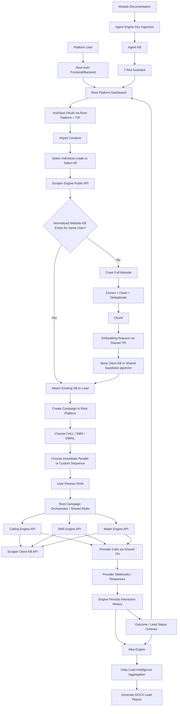

# T Rex — Master Product Requirements Document (PRD) v7

**Repository:** `https://github.com/hamzi2186/TeamProject`  
**Document type:** Master PRD / team-wide single source of truth  
**Primary implementation target:** Team implementation + Codex or any capable coding agent/IDE  
**Status:** Final team-share specification with instructor-approved modular architecture + locked frontend design system + strict TPI integration boundary + Idea Engine reporting  
**Product name:** **T Rex**  
**Tagline:** **Hunt Leads. Command Conversions.**  
**MVP deadline context:** next-day team delivery; prioritize working end-to-end flows over optional polish, but do not violate the architecture contracts below.

**Architecture revision note:** The original product contracts are preserved. The instructor-approved code layout uses a shared root Auth/platform foundation, a strict shared TPI integration boundary, one integrated Supabase/PostgreSQL project, and independent top-level engine folders with their own frontend/backend. All third-party service/provider integrations live inside TPI. Idea Engine is the internal reporting/analysis engine that aggregates normalized lead interactions across Calling, SMS, and Mailer and produces end-of-day DOCX lead reports. The Frontend Design PRD is incorporated into this Master PRD and is mandatory for every frontend.

---

## 0. Non-Negotiable Instructions to Any Coding Agent

This PRD is the source of truth for the project.

The instructor's latest architecture clarification overrides the old physical layout that placed all engines inside one root frontend and one root backend. Product behavior and shared contracts from the original PRD remain valid unless explicitly changed below.

1. **Do not invent product requirements.**
2. **Do not rename core engines or change their responsibilities without explicit approval.**
3. **Root authentication + basic Docker + shared Supabase/PostgreSQL conventions are shared platform foundations.** The Scraper owner is responsible for creating this initial foundation and pushing it first so all teams can pull and build on it.
4. **Each customer-facing engine is a self-contained top-level module with its own `frontend/` and `backend/`.** This applies to Scraper, Calling, SMS, Mailer, Idea, and Agent.
5. **Engine isolation means no private engine-to-engine source imports.** It does **not** mean engines are forbidden from depending on shared root authentication, the same Supabase/PostgreSQL project, shared Redis conventions, TPI, or documented platform contracts.
6. **TPI is the exclusive home for all third-party service/provider integrations.** HubSpot, Twilio, Vapi, Resend, SMTP, Jina, LLM vendors, and any future external provider integration must be implemented inside TPI, not inside root backend code or engine backends.
7. **Agent Engine remains a separate customer-facing engine.** It is not the shared foundation and other engines do not depend on Agent implementation code.
7A. **Idea Engine is a separate reporting/analysis engine.** It consumes normalized internal lead/conversation data produced by Calling, SMS, and Mailer, and generates daily DOCX lead reports. It does not own outreach and does not integrate directly with external providers.
8. **Do not use Supabase Auth.** Supabase is the shared PostgreSQL/pgvector provider for the integrated MVP.
9. **Do not create one `user_id` per lead.** One platform user owns many leads.
10. **Do not scrape the same website repeatedly for leads belonging to the same platform user when the normalized website already has a valid knowledge base.**
11. **Do not expose TPI internals to customers or to the customer-facing Agent Engine knowledge base.**
12. **Do not make Calling, SMS, or Email outbound-only.** All three are designed as two-way communication engines.
13. **Do not fake provider integrations in the real integration acceptance path.** Mock providers may exist for automated tests only.
14. **SMS and voice have different demo routing rules.** Real two-way SMS MVP testing is **US Twilio number ↔ US recipient number**. Voice may be tested **US Twilio/Vapi number → US recipient** or **US Twilio/Vapi number → Pakistan +92 recipient** when account capability/geographic permissions allow it.
15. **Root platform and engines must not contain provider SDK/client logic.** Provider SDK imports, provider API calls, OAuth token exchange/refresh, provider-specific webhook signature verification/parsing, and provider secrets belong only to TPI. Root/engine code consumes TPI through documented internal contracts/services.
16. **Do not silently discard provider webhooks.** Validate, deduplicate, persist, and process them.
17. **Do not delete complete knowledge bases when one document changes.** Agent documentation ingestion must update only the affected source/chunks.
18. **Do not expose secrets, API keys, OAuth tokens, provider tokens, or webhook secrets to any frontend.**
19. **Every engine must be independently runnable from its own folder.** Copying an engine folder to another machine must not require another engine's source tree. Shared services such as root auth, TPI, Supabase, Redis, or public APIs may be configured by URL/credentials. Provider credentials are never copied into engine configuration.
20. If a low-level implementation detail is not specified, use the default stated in this PRD. If there is truly no default, create a clear `TODO` and keep the implementation configurable rather than guessing.

# 1. Product Summary

T Rex is a **HubSpot-connected, knowledge-aware, multi-channel autonomous outreach platform**.

A platform user connects HubSpot using OAuth. The application imports HubSpot contacts/leads containing four required fields:

- Name
- Phone number
- Email
- Website URL

The Scraping Engine crawls each unique lead website, extracts useful website content, cleans it, chunks it, creates embeddings, and stores a reusable website/company knowledge base in Supabase PostgreSQL with pgvector.

The same client knowledge base is then shared by three autonomous two-way communication engines:

- **Calling Engine**
- **SMS Engine**
- **Mailer Engine**

The platform user creates a campaign, chooses any combination of the three communication channels, and can run them:

- immediately,
- in parallel,
- or in a custom sequence with user-defined delays.

After the user presses **Run**, selected engines execute automatically. Incoming responses are received through provider webhooks, matched to the correct user/lead/conversation, analyzed using the relevant client knowledge base, answered automatically, and persisted for dashboard visibility.

A separate **Idea Engine** aggregates all persisted inbound/outbound Calling, SMS, and Mailer interactions for every lead and produces an end-of-day `.docx` lead report describing how each lead was approached, what happened in the conversations, and the resulting interest/outcome state.

A separate **Agent Engine** powers the website/platform chatbot. It is a self-contained top-level engine with its own frontend and backend. It does **not** use client website knowledge by default. It uses a separate unified platform knowledge base contributed and maintained by the Scraper, Calling, SMS, and Mailer teams. It explains what the platform does and how its modules work.

A separate internal **TPI Engine (Third-Party Integration Engine)** is shared infrastructure. It centralizes reusable provider/integration adapters used by the root platform and engines. TPI is engineering infrastructure, has no customer-facing page, and is consumed through documented internal APIs/contracts rather than private source imports.

---

# 2. Locked Product Modules

The master product consists of the following modules.

## 2.1 Scraping Engine

Responsibilities:

- Receive website URLs originating from imported HubSpot leads.
- Normalize website URLs.
- Detect whether a valid KB for the same normalized website already exists for the same platform user.
- Reuse existing knowledge bases instead of re-crawling duplicates.
- Crawl the full reachable website on the same origin.
- Extract meaningful content.
- Clean and deduplicate content.
- Chunk text.
- Generate embeddings.
- Store pages/documents/chunks/embeddings in Supabase.
- Expose ingestion status and errors.
- Allow refresh/re-crawl.
- Mark KB as ready only when ingestion completes successfully.

## 2.2 Calling Engine

Responsibilities:

- Initiate real outbound AI calls to selected US lead phone numbers.
- Receive inbound calls on the configured US provider number where applicable.
- Conduct real-time AI voice conversation.
- Retrieve client KB context during calls.
- Store call metadata, transcript, duration, direction, summary, outcome, and status.
- Decide when conversation/call objective is complete.
- Assign/update lead outcome.
- Support scheduled campaign steps.
- Integrate through TPI, not provider code directly.

**Reference provider:** Vapi for voice AI orchestration + Twilio US number/telephony.

## 2.3 SMS Engine

Responsibilities:

- Send real outbound SMS from a US Twilio-capable number to US recipient numbers.
- Receive inbound SMS replies through webhook.
- Match replies to the correct user, lead, campaign, and conversation.
- Retrieve client KB context.
- Generate and send autonomous replies.
- Continue conversation until AI detects a conclusion or stop condition.
- Store complete inbound/outbound message history and delivery status.
- Assign/update lead outcome.
- Integrate through TPI.

**Reference provider:** Twilio Programmable Messaging.

## 2.4 Mailer Engine

Responsibilities:

- Generate and send personalized emails using client KB context.
- Receive inbound email replies.
- Correlate replies to the correct conversation.
- Analyze replies and generate autonomous responses.
- Continue thread until AI detects a conclusion or stop condition.
- Persist thread history, provider IDs, subject, body, status, timestamps, and outcome.
- Integrate through TPI.

**Reference provider:** Resend.

## 2.5 Agent Engine

Responsibilities:

- Power the customer-facing website/platform chatbot.
- Explain how the product works.
- Explain Scraper, Calling, SMS, and Mailer behavior.
- Explain HubSpot connection and platform workflow.
- Answer questions from a unified internal platform documentation KB.
- Perform RAG over only the platform documentation KB.
- Remain read-only for ordinary platform customers.

The Agent Engine must **not expose TPI implementation details**.

## 2.6 Idea Engine — Lead Intelligence and Daily Reporting

Responsibilities:

- Collect normalized inbound and outbound interaction history for every lead across:
  - Calling,
  - SMS,
  - Mailer.
- Combine those interactions into one chronological lead journey.
- Record how the lead was approached:
  - channel,
  - campaign,
  - timestamp,
  - inbound/outbound direction,
  - sequence/order where available.
- Summarize what happened in each conversation.
- Determine/report the current lead outcome using the canonical outcome vocabulary.
- Distinguish at minimum:
  - interested,
  - not interested,
  - follow-up required,
  - converted,
  - no answer,
  - no response,
  - do not contact,
  - failed/unknown where evidence is insufficient.
- Produce an end-of-day report covering all relevant leads.
- Generate the final report as a `.docx` document.
- Make generated reports available for download through the Idea Engine frontend/API.
- Keep report generation reproducible from persisted data, not browser state.

### Idea Engine data source

Idea Engine consumes **internal normalized T Rex data** from the shared Supabase/PostgreSQL project and/or documented internal APIs.

It may read:

- `leads`,
- `campaigns`,
- `campaign_targets`,
- `campaign_steps`,
- `scheduled_actions`,
- `conversations`,
- `calls`,
- `sms_messages`,
- `emails`,
- `lead_status_history`,
- normalized communication/activity events.

It must not:

- import Calling/SMS/Mailer private source code,
- directly call Twilio,
- directly call Vapi,
- directly call Resend,
- process provider-specific webhook formats,
- modify another engine's private business records unless a documented shared contract explicitly allows it.

### Daily DOCX report minimum content

The report must include:

1. Report date and generation timestamp.
2. Overall summary:
   - total leads reviewed,
   - interested,
   - not interested,
   - follow-up required,
   - converted,
   - no answer/no response,
   - do not contact,
   - failed/unknown.
3. One section per lead containing:
   - lead name,
   - company/website where available,
   - email and phone where available,
   - campaigns involved,
   - channels used,
   - chronological approach timeline,
   - inbound/outbound conversation summary,
   - latest/final outcome,
   - concise evidence/reason for the outcome,
   - recommended next action when the canonical state implies one.
4. Clear separation between factual persisted events and generated summary/classification.

### Scheduling

The default product behavior is to generate one report at the end of each day through the shared scheduling/Celery infrastructure.

The exact clock time must be configurable by environment and must not be hard-coded into business logic.

### DOCX generation

DOCX creation is local application functionality, not a third-party provider integration.

A library such as `python-docx` may be used inside Idea Engine backend.

No TPI call is required merely to construct the `.docx` file.


## 2.7 TPI Engine — Third-Party Integration Engine

TPI is the **exclusive third-party integration boundary** for T Rex.

Responsibilities:

- Internal-only shared integration service/layer.
- Own all external provider SDKs, HTTP clients, OAuth exchanges, provider authentication, provider credentials, and provider-specific configuration.
- Own all provider-facing webhook endpoints and provider-specific signature verification/parsing.
- Normalize provider responses/events into internal T Rex contracts.
- Prevent root platform code and engine teams from reimplementing vendor integrations.
- Standardize provider errors, retries, rate-limit handling, webhook validation, and response mapping.
- Expose documented internal APIs/contracts that root platform services and engines consume.
- Keep provider secrets out of root frontend/backend and all engine frontends/backends.

Required/current provider families include:

- HubSpot OAuth/API
- Twilio SMS
- Twilio telephony
- Vapi
- Resend
- SMTP email delivery
- LLM providers such as Groq-compatible providers
- Embedding providers including Jina and the configured local fallback adapter where applicable

There is **no customer-facing TPI page**.

### Strict ownership examples

Allowed:

```text
Root HubSpot UI -> Root backend -> TPI HubSpot API -> HubSpot
SMS Engine -> TPI SMS API -> Twilio
Calling Engine -> TPI Voice API -> Vapi/Twilio
Mailer Engine -> TPI Email API -> Resend
Root Auth -> TPI Email Delivery API -> SMTP provider
Scraper Engine -> TPI Embeddings API -> Jina/local embedding adapter
Agent Engine -> TPI LLM/Embeddings API -> configured providers
```

Forbidden:

```text
root backend -> import hubspot SDK/client
sms-engine -> import twilio
calling-engine -> import vapi/twilio
mailer-engine -> import resend
root auth -> connect to SMTP directly
scraper-engine -> call Jina SDK/API directly
agent-engine -> call LLM vendor SDK directly
```

### Provider webhook rule

External provider webhooks terminate at TPI first.

TPI must:

1. receive the provider webhook,
2. verify the provider-specific signature/authenticity,
3. deduplicate provider event IDs where applicable,
4. preserve the raw provider payload for audit/debugging,
5. normalize the event into a provider-neutral internal contract,
6. dispatch/forward the normalized event to the owning root service or engine.

Business engines process the normalized internal event. They do not implement provider-specific webhook verification.

### Infrastructure exclusion

The following are shared infrastructure dependencies and are **not** treated as TPI provider adapters:

- Supabase-hosted PostgreSQL / pgvector as the platform data store,
- Redis as queue/cache infrastructure,
- ordinary website crawling performed by the Scraper Engine.

Those remain owned by their platform/engine responsibilities.

### TPI source-dependency rule

Independent engines consume TPI through documented internal HTTP/service contracts. They must not import TPI's private implementation source. A generated client/schema is allowed only if it is reproducible from the published contract and contains no provider secrets or private implementation logic.

## 2.8 Shared Platform Layer

The root platform is the common foundation that all engine teams pull before beginning engine work.

Shared responsibilities include:

- First-party authentication frontend and backend
- SMTP OTP verification and password reset
- User/tenant identity context
- Shared Supabase-hosted PostgreSQL project and database conventions
- Root database connection and platform-owned migrations
- Root Docker Compose and environment conventions
- Shared Redis service for integrated development/runtime
- Campaign orchestration and scheduling contracts
- Unified dashboard aggregation
- Common wire values/status contracts
- Webhook/idempotency conventions
- Observability/logging conventions
- Service discovery/base URLs
- Root frontend platform pages such as Auth, HubSpot, Leads, Campaigns, and Dashboard
- Root orchestration/business logic that calls TPI for every third-party provider operation

### Important boundary

Shared foundation dependency is **allowed and required**. Engine-to-engine private source dependency is **forbidden**.

For example:

```text
Calling -> shared Auth contract        ALLOWED
Calling -> same Supabase project       ALLOWED
Calling -> shared TPI service          ALLOWED
Calling -> Scraper public KB API       ALLOWED

Calling -> import Scraper Python code  FORBIDDEN
Mailer  -> import SMS private code      FORBIDDEN
```

The first shared foundation is implemented and pushed by the Scraper owner before engine teams branch into their own modules.

# 3. Canonical Terminology

Use these terms consistently in code and documentation.

| Term | Meaning |
|---|---|
| Platform User | The person/company user who logs into T Rex and connects HubSpot |
| Lead | A HubSpot contact imported into T Rex |
| Client Knowledge Base / Client KB | Website-derived vector knowledge used by Calling/SMS/Mailer |
| Platform Knowledge Base / Agent KB | Internal module documentation used by Agent Engine chatbot |
| Website | A normalized unique company/site URL for a platform user |
| Campaign | User-defined outreach operation targeting one or more leads |
| Channel | `CALL`, `SMS`, or `EMAIL` |
| Conversation | A logical two-way thread for one lead and one channel within a campaign |
| Communication Event | Any inbound/outbound SMS/email/call-related activity persisted for history |
| Idea Engine | Internal lead-intelligence/reporting engine that aggregates multi-channel interactions and generates daily DOCX reports |
| TPI | Internal Third-Party Integration layer |
| Provider | Twilio, Vapi, Resend, HubSpot, LLM vendor, etc. |

Internally use `lead_id`, not a second `user_id`, for HubSpot contacts.

---

# 4. High-Level End-to-End Workflow



The physical code layout is modular even though the user experiences one integrated product.

# 5. Locked Technology Stack

## Frontend

- React
- Vite
- TypeScript
- Tailwind CSS
- shadcn/ui as the component primitive foundation
- TanStack Query for server-state fetching/caching
- React Router for routes
- Recharts for dashboard charts
- Framer Motion for subtle functional motion
- Lucide icons
- Geist as the primary UI font

The locked visual and interaction system is defined in **Section 32** and applies to the root frontend and every engine frontend.

## Backend

- Python 3.11+
- FastAPI
- Pydantic v2
- SQLAlchemy 2.x
- Alembic migrations
- `httpx` for HTTP integrations

## Database / Vector Storage

- Supabase-hosted PostgreSQL
- pgvector extension
- All operational data in PostgreSQL
- Vectors in pgvector
- Authentication itself is **not** Supabase Auth

## Background Work

- Celery
- Redis
- Separate queues by responsibility

## Scraping

Reference implementation:

- `httpx`
- `BeautifulSoup4`
- `trafilatura` for main-content extraction/cleaning
- XML sitemap parsing
- Playwright fallback for JavaScript-rendered pages

## Embeddings

Integrated MVP primary:

- **Jina AI embedding API**

Fallback:

- **local embedding provider/model**, configurable by environment.

The exact embedding dimension is **not globally hard-coded** by this Master PRD.

Embedding behavior is exposed through the shared TPI `EmbeddingProvider` contract/service so the Scraper Engine does not scatter vendor SDK calls in crawler business logic.

Rules:

- Persist the embedding provider, model, and dimension with each knowledge base.
- Query embeddings for a KB must use the same embedding model/vector space used to build that KB.
- Do not mix vectors from different embedding models inside the same KB.
- If the primary embedding provider fails before a KB embedding run is complete, the embedding stage may restart consistently using the configured fallback.
- Vector schema/index creation must match the configured embedding dimension.

## General Text LLM

MVP default:

- Groq-compatible chat completion adapter, configured by environment variable.

The business layer must use an `LLMProvider` interface. No engine may directly scatter vendor SDK calls across services.

## Communication Providers

- SMS: Twilio
- Calling: Vapi + Twilio US telephony number
- Email: Resend

## Containerization

- Docker
- Docker Compose

---

# 6. Repository State and Required Monorepo Structure

The repository is a monorepo, but customer-facing engines are **vertical, independently runnable applications**.

The root platform is the shared foundation. Scraper, Calling, SMS, Mailer, Idea, and Agent are separate top-level engine folders. TPI is shared internal infrastructure.

Required structure:

```text
TeamProject/
├── README.md
├── MASTER_PRD.md
├── .env.example
├── .gitignore
├── docker-compose.yml                 # integrated/root runtime
│
├── frontend/                          # ROOT PLATFORM FRONTEND
│   ├── package.json
│   ├── vite.config.ts
│   ├── tsconfig.json
│   ├── Dockerfile
│   └── src/
│       ├── app/
│       ├── auth/
│       ├── layouts/
│       ├── components/
│       ├── features/
│       │   ├── dashboard/
│       │   ├── hubspot/
│       │   ├── leads/
│       │   └── campaigns/
│       ├── pages/
│       ├── api/
│       ├── hooks/
│       ├── lib/
│       ├── types/
│       ├── styles/
│       └── assets/
│
├── backend/                           # ROOT PLATFORM BACKEND
│   ├── pyproject.toml
│   ├── requirements.txt
│   ├── alembic.ini
│   ├── alembic/
│   ├── Dockerfile
│   └── app/
│       ├── main.py
│       ├── core/
│       ├── auth/
│       ├── db/
│       ├── models/
│       ├── schemas/
│       ├── api/
│       ├── services/
│       ├── workers/
│       └── contracts/
│
├── tpi-engine/                        # SHARED INTERNAL INFRASTRUCTURE
│   ├── backend/
│   │   ├── Dockerfile
│   │   ├── requirements.txt
│   │   └── app/
│   │       ├── api/
│   │       ├── providers/
│   │       │   ├── hubspot/
│   │       │   ├── twilio/
│   │       │   ├── vapi/
│   │       │   ├── resend/
│   │       │   ├── smtp/
│   │       │   ├── llm/
│   │       │   └── embeddings/
│   │       └── contracts/
│   ├── .env.example
│   └── README.md
│
├── scraper-engine/
│   ├── frontend/
│   ├── backend/
│   ├── docker-compose.yml
│   ├── .env.example
│   ├── README.md
│   └── tests/
│
├── calling-engine/
│   ├── frontend/
│   ├── backend/
│   ├── docker-compose.yml
│   ├── .env.example
│   ├── README.md
│   └── tests/
│
├── sms-engine/
│   ├── frontend/
│   ├── backend/
│   ├── docker-compose.yml
│   ├── .env.example
│   ├── README.md
│   └── tests/
│
├── mailer-engine/
│   ├── frontend/
│   ├── backend/
│   ├── docker-compose.yml
│   ├── .env.example
│   ├── README.md
│   └── tests/
│
├── idea-engine/
│   ├── frontend/
│   ├── backend/
│   ├── docker-compose.yml
│   ├── .env.example
│   ├── README.md
│   └── tests/
│
├── agent-engine/
│   ├── frontend/
│   ├── backend/
│   ├── docker-compose.yml
│   ├── .env.example
│   ├── README.md
│   └── tests/
│
├── contracts/                         # wire/API specs, not shared runtime source
│   ├── auth/
│   ├── tpi/
│   ├── events/
│   └── enums/
│
├── docs/
│   ├── architecture/
│   ├── api/
│   ├── prd/
│   └── agent-knowledge/
│       ├── scraper/
│       ├── calling/
│       ├── sms/
│       └── mailer/
│
└── scripts/
```

## 6.1 Engine portability rule

Each customer-facing engine must contain its own frontend and backend dependencies, Dockerfiles, environment example, tests, and run instructions.

A module may depend on configured shared services:

- root Auth/JWKS,
- the same Supabase/PostgreSQL project,
- shared Redis in integrated mode,
- shared TPI,
- another engine's **public API** where the product requires it.

A module must **not** require another engine's source directory.

## 6.2 Root foundation rule

The Scraper owner first creates and pushes:

```text
frontend/          # root auth/platform frontend
backend/           # root auth/platform backend
docker-compose.yml
.env.example
README.md
```

with basic Docker, authentication, Supabase/PostgreSQL configuration, Redis/Celery foundation, and health checks.

All teammates pull this common foundation before starting their engine folders.

## 6.3 Forbidden old physical layout

Do not place final engine implementations under:

```text
frontend/src/features/calling
frontend/src/features/sms
frontend/src/features/mailer
frontend/src/features/knowledge
frontend/src/features/assistant

backend/app/modules/scraper
backend/app/modules/calling
backend/app/modules/sms
backend/app/modules/mailer
backend/app/modules/agent
```

Those features belong inside the corresponding top-level engine folder.

# 7. Shared Authentication Contract and Implementation

Authentication is a **shared root-platform responsibility** and is implemented first by the Scraper owner so all teams can build against the same identity contract.

Do **not** use Supabase Auth.

## 7.1 Required user context

Every successfully authenticated request must resolve to:

```json
{
  "user_id": "uuid",
  "role": "customer | developer | team_member | admin"
}
```

Preferred customer/API transport:

```http
Authorization: Bearer <access_token>
```

Root backend exposes its canonical dependency internally:

```python
get_current_user() -> AuthenticatedUser
```

Independent engine backends do not import that Python function. They verify the same signed token contract through the configured public key/JWKS and expose an equivalent local dependency that resolves the same `AuthenticatedUser` shape.

## 7.2 First-party auth flows

Required:

- register,
- 6-digit email OTP verification,
- resend verification OTP,
- login,
- refresh token,
- logout,
- forgot password,
- reset password,
- current user.

Auth does not connect to SMTP directly. For verification and password-reset emails, the root Auth backend calls the TPI Email Delivery contract. SMTP host, credentials, TLS settings, and provider-specific email delivery configuration exist only inside TPI.

## 7.3 Security requirements

- Modern password hashing.
- Normalize email addresses.
- OTP generated using a cryptographically secure source.
- OTP hash stored, not plaintext.
- OTP single-use and expiring.
- Verification attempt limit.
- Resend cooldown/rate limit.
- Short-lived access JWT.
- Rotating/revocable refresh tokens.
- Refresh-token hashes persisted, not plaintext.
- Secure/HttpOnly refresh cookie in production where browser flow is used.
- Prefer asymmetric JWT signing so engines receive only public verification material.
- Never expose auth secrets to any frontend.

## 7.4 Required roles

### `customer`
May:
- connect HubSpot,
- import/select leads,
- create/run campaigns,
- use dashboard,
- use T Rex Assistant.

May not:
- alter Agent Engine source documentation,
- manage TPI internals,
- access another user's data.

### `developer`
May:
- maintain Agent docs,
- trigger docs ingestion,
- access internal diagnostics allowed by policy.

### `team_member`
Same Agent-doc capability as developer for team-owned module.

### `admin`
May:
- manage/reingest Agent documentation,
- access internal operational views.

## 7.5 Engine dependency rule

All engines use this shared auth identity. They do not build separate user/login systems and do not create duplicate `app_users` identities.

# 8. Tenant and ID Model

One platform user can own many leads.

Correct relationship:

```text
user_id
  ├── lead_id
  ├── lead_id
  ├── lead_id
  └── ...
```

Example:

```text
USER_001
├── LEAD_001 (Sharmat, Cyberify)
├── LEAD_002 (Awais, Cyberify)
└── LEAD_003 (Hamza, Cyberify)
```

All operational records must include or be transitively scoped to `user_id`.

No user may access data belonging to another user.

---

# 9. HubSpot Integration

HubSpot is a third-party integration and therefore **all HubSpot provider-facing logic belongs to TPI**.

The root frontend owns the customer-facing HubSpot connect/import experience. The root backend owns lead import/upsert business logic. TPI owns the actual HubSpot integration.

## 9.1 Connection

The customer clicks:

> Connect HubSpot

Flow:

```text
Root frontend
 -> root backend asks TPI for HubSpot connect URL
 -> TPI creates OAuth authorization request
 -> HubSpot
 -> HubSpot redirects to TPI callback endpoint
 -> TPI validates OAuth state
 -> TPI exchanges authorization code for tokens
 -> TPI securely stores/encrypts HubSpot credentials
 -> TPI returns/redirects normalized connection result to root platform
```

Rules:

- HubSpot SDK/API client code lives only in TPI.
- HubSpot client ID/secret live only in TPI configuration.
- HubSpot access/refresh tokens are owned by TPI and never exposed to browsers or engine code.
- Root backend must not exchange or refresh HubSpot tokens itself.
- Root/engine code calls TPI's internal HubSpot contract.

## 9.2 Required Imported Contact Properties

The minimum imported properties are exactly:

- `firstname`
- `lastname`
- `phone`
- `email`
- `website`

TPI retrieves/maps the HubSpot contact payload into a provider-neutral internal contact contract.

The root platform constructs/updates canonical lead records from that normalized contract.

Construct display name from first/last name.

If a required field is missing:

- Import the lead record anyway.
- Mark relevant capability unavailable:
  - no phone => Calling/SMS unavailable,
  - no email => Mailer unavailable,
  - no website => client KB unavailable until website supplied.
- Show missing-data reason in UI.

## 9.3 Contact Selection

The user must be able to:

- select individual HubSpot contacts,
- select multiple contacts,
- use **Select All** / import all.

The root platform owns selection/import UX and lead persistence. Contact retrieval itself is performed through TPI.

## 9.4 Sync Rules

Store HubSpot's source contact ID in canonical lead data:

```text
hubspot_contact_id
```

Use `(user_id, hubspot_contact_id)` as an idempotent lead import key.

Repeated import must update the existing lead instead of duplicating it.

Provider credentials remain TPI-owned.

---

# 10. Website Normalization and Knowledge-Base Reuse

This is a core architecture requirement.

## 10.1 Goal

If multiple leads owned by the same platform user have exactly the same underlying website, crawl the site once and reuse its KB.

Example:

```text
Sharmat -> https://cyberify.io
Awais   -> https://www.cyberify.io/
Hamza   -> http://cyberify.io
```

All should normalize to a canonical website identity such as:

```text
cyberify.io
```

and point to one website KB for that platform user.

## 10.2 Normalization

Normalization must:

- lowercase hostname,
- strip `www.`,
- remove default ports,
- normalize trailing `/`,
- discard fragments,
- normalize scheme where appropriate,
- preserve meaningful subdomains,
- preserve path only when website URL intentionally points to a path-specific site root.

Store:

- original URL,
- normalized URL,
- normalized host/domain.

## 10.3 Dedupe Key

For MVP:

```text
(user_id, normalized_website_key)
```

Do **not** globally share one user's scraped KB with another user's account.

## 10.4 Reuse Flow

```text
Lead URL
  -> normalize
  -> query websites by user_id + normalized key
      -> if READY KB exists: attach lead to existing website/KB
      -> if INGESTING: attach and wait for same job
      -> if FAILED or stale: allow retry
      -> if no record: create website + crawl job
```

---

# 11. Scraping Engine Detailed Requirements

## 11.1 Crawl Scope

Functional requirement:

> Crawl all reachable same-origin website pages that can reasonably be discovered from the starting website.

Discovery order:

1. `robots.txt`
2. `sitemap.xml` / sitemap index where available
3. homepage
4. same-origin internal links discovered during crawl

Do not crawl external domains.

## 11.2 Crawl Guardrail

The product requirement is full-site crawling, but crawlers require an operational safety guardrail.

Use:

```env
CRAWL_MAX_PAGES=200
```

Default 200 for MVP.

If the limit is reached before crawl completion:

- mark crawl as `PARTIAL`,
- retain all collected data,
- show reason,
- allow operator to raise/disable the limit without changing code.

`CRAWL_MAX_PAGES=0` may represent unlimited crawling.

## 11.3 URL Exclusions

Skip by default:

- mailto:
- tel:
- javascript:
- logout paths
- auth/session endpoints
- obvious cart/checkout mutation URLs
- duplicate querystring tracking variants
- binary assets not intended for text extraction

## 11.4 JavaScript Sites

Try normal HTTP fetch first.

If extracted body content is effectively empty or obviously client-rendered, use Playwright fallback.

## 11.5 Content Extraction

For each page store:

- URL
- canonical URL
- title
- meta description
- cleaned main text
- content hash
- HTTP status
- fetched timestamp

Use `trafilatura` or equivalent main-content extraction; BeautifulSoup may be used for metadata and link discovery.

## 11.6 Cleaning

Remove:

- nav repetition,
- cookie banners,
- footer repetition,
- scripts/styles,
- repeated boilerplate,
- empty blocks,
- duplicate page content where content hash is identical.

## 11.7 Chunking

Default:

- 700–1,000 tokens per chunk
- 100–150 token overlap
- preserve source page metadata
- prefer semantic paragraph/heading boundaries over hard character cuts.

## 11.8 Embedding

Use the shared TPI embedding contract.

Integrated MVP primary:

```text
Jina AI embedding API
```

Fallback:

```text
configured local embedding provider/model
```

The Scraper Engine must not call the Jina SDK or another vendor SDK directly from crawler business logic.

Persist:

- embedding provider,
- embedding model,
- embedding dimension.

The dimension is configuration-driven and must not be assumed to be 384 in business logic.

## 11.9 Knowledge Base Status

Allowed statuses:

```text
PENDING
CRAWLING
PROCESSING
EMBEDDING
READY
PARTIAL
FAILED
REFRESHING
```

Calling/SMS/Mailer may use only `READY` or explicitly approved `PARTIAL` KBs.

---

# 12. Client Knowledge Base Design

The Client KB is derived from lead websites and is used only by communication engines.

It is separate from Agent Engine documentation.

Retrieval query must be filtered by:

```text
user_id
knowledge_base_id
```

Never run unscoped vector search across all users.

Default retrieval:

- top K = 6
- cosine similarity
- optional minimum similarity threshold
- return source URL/title with every chunk

The AI layer should receive both:
- relevant chunks,
- lead metadata.

---

# 13. Campaign System

## 13.1 Campaign Creation

User chooses:

- campaign name,
- one or more leads,
- one or more channels:
  - Calling
  - SMS
  - Email
- execution mode.

## 13.2 Supported Channel Combinations

All are valid:

- Call only
- SMS only
- Email only
- Call + SMS
- Call + Email
- SMS + Email
- Call + SMS + Email

## 13.3 Execution Modes

### Immediate / Single Channel

Example:

```text
SMS -> now
```

### Parallel

Example:

```text
Call  ─┐
SMS   ─┼─> start at same scheduled time
Email ─┘
```

### Custom Sequence

User can define arbitrary delays.

Example:

```text
Email
  -> wait 2 hours
SMS
  -> wait 1 day
Call
```

Delays are user-configurable.

Store delays as seconds or absolute schedule timestamps.

## 13.4 Campaign Builder Data Model

A campaign must compile into deterministic steps.

Example:

```json
[
  {
    "order": 1,
    "channel": "EMAIL",
    "delay_after_previous_seconds": 0,
    "parallel_group": 1
  },
  {
    "order": 2,
    "channel": "SMS",
    "delay_after_previous_seconds": 7200,
    "parallel_group": 2
  },
  {
    "order": 3,
    "channel": "CALL",
    "delay_after_previous_seconds": 86400,
    "parallel_group": 3
  }
]
```

For parallel actions, steps can share the same `parallel_group` and scheduled timestamp.

## 13.5 Run Behavior

Nothing executes before explicit customer **Run**.

After Run:

- backend validates channel prerequisites,
- campaign becomes `RUNNING`,
- Celery schedules steps,
- no further manual action is required.

---

# 14. Campaign and Conversation State Machines

## Campaign Status

```text
DRAFT
VALIDATING
SCHEDULED
RUNNING
PAUSED
COMPLETED
PARTIALLY_COMPLETED
FAILED
CANCELLED
```

No human-takeover feature is required for this version.

## Lead Campaign Outcome

Canonical outcomes:

```text
NEW
CONTACTING
INTERESTED
NOT_INTERESTED
FOLLOW_UP_REQUIRED
NO_ANSWER
NO_RESPONSE
CONVERTED
DO_NOT_CONTACT
COMPLETED
FAILED
```

The AI engine may decide a conversation has reached a conclusion and assign an outcome.

## Conversation Status

```text
OPEN
WAITING_FOR_LEAD
WAITING_FOR_AGENT
SCHEDULED_FOLLOWUP
CONCLUDED
FAILED
CANCELLED
```

---

# 15. Autonomous Conversation Policy

Calling, SMS, and Email are autonomous after campaign Run.

The engine should:

1. load lead and campaign context,
2. retrieve relevant KB context,
3. create a response,
4. send/communicate,
5. persist output,
6. receive reply/event,
7. persist inbound data,
8. retrieve new KB context if needed,
9. generate the next response,
10. continue until conclusion.

The AI must be instructed to stop when:

- lead explicitly says no / stop / unsubscribe,
- outcome is conclusively reached,
- communication provider indicates hard failure,
- configured max-turn guardrail is reached,
- campaign is cancelled.

Default text conversation guardrail:

```env
MAX_AUTONOMOUS_TEXT_TURNS=20
```

This is a safety/loop-prevention limit, not a normal product stopping rule.

---

# 16. SMS Engine

The SMS Engine owns conversation/business logic and persistence. **Twilio integration is owned only by TPI.**

## 16.1 Demo Route

Hard MVP target:

```text
US Twilio Number <-> US Recipient Number
```

Both outbound and inbound must work for the real integration test.

## 16.2 Outbound Flow

```text
campaign step
 -> SMS Engine
 -> retrieve Client KB
 -> generate message through TPI LLM contract
 -> SMS Engine requests send via TPI SMS contract
 -> TPI Twilio adapter
 -> Twilio
 -> US lead
 -> TPI returns normalized provider result
 -> SMS Engine persists message/provider reference/status
```

The SMS Engine must not import or instantiate the Twilio SDK.

## 16.3 Inbound Flow

```text
US lead replies
 -> Twilio provider webhook
 -> TPI webhook endpoint
 -> TPI validates Twilio signature
 -> TPI deduplicates/preserves raw provider event
 -> TPI normalizes inbound SMS event
 -> TPI forwards internal event to SMS Engine
 -> SMS Engine resolves lead/conversation
 -> SMS Engine persists inbound SMS
 -> enqueue autonomous response task
 -> retrieve KB
 -> generate response through TPI LLM contract
 -> request send through TPI SMS contract
 -> persist normalized outbound result
```

## 16.4 Delivery Status

Twilio delivery-status callbacks terminate at TPI.

TPI validates and normalizes the provider callback, then forwards an internal delivery event to the SMS Engine.

Persist business-visible statuses:

- queued
- sent
- delivered
- undelivered
- failed

## 16.5 Compliance Prerequisite

US application-generated messaging may require sender registration/verification depending on number type and route.

Provider/account setup is a TPI/operator configuration prerequisite, not SMS Engine code to bypass.

The application must surface normalized provider/compliance errors rather than pretending a message succeeded.

---

# 17. Calling Engine

The Calling Engine owns call business state, campaign context, transcript/outcome persistence, and Client KB usage. **Vapi and Twilio provider integration is owned only by TPI.**

## 17.1 Reference Architecture

```text
Campaign Orchestrator
        |
        v
Calling Engine
        |
        v
TPI Voice Contract
        |
   +----+----+
   |         |
 Vapi      Twilio
   |         |
   +----+----+
        |
        v
      Lead
```

### Supported voice test routes

1. **US → US:** configured US Twilio/Vapi number calls a US recipient.
2. **US → Pakistan:** the same imported US Twilio number may call a Pakistani `+92` recipient when geographic permissions/account capability allow it.
3. Once connected, the call is naturally two-way voice.
4. **Inbound to the US number:** callers who can dial that US number may be routed to the configured Vapi assistant.
5. Keep phone numbers in E.164 format.

Provider setup, number import/configuration, geographic permissions, Vapi assistant configuration, and Twilio credentials live inside TPI/operator configuration.

## 17.2 Voice Agent Requirements

The Calling Engine must supply/maintain the business context required by the voice agent:

- target lead identity,
- campaign purpose,
- relevant Client KB context/tool contract,
- conversation/outcome rules,
- persistence identifiers.

The voice experience must:

- answer lead questions conversationally,
- avoid inventing company facts when KB has no evidence,
- determine a call outcome,
- produce transcript/summary artifacts.

## 17.3 KB Retrieval During Call

The Scraper Engine exposes the public Client-KB retrieval contract.

Because Vapi is a third-party provider, any provider-facing tool endpoint/callback used by Vapi must terminate in TPI.

Preferred flow:

```text
Vapi tool call
 -> TPI Vapi/tool endpoint
 -> TPI validates provider request/context
 -> TPI calls Scraper public Client-KB API
 -> TPI returns normalized tool result to Vapi
```

The server must resolve the lead's KB and validate tenant ownership.

Never let the provider select an arbitrary `knowledge_base_id` without server-side tenant validation.

## 17.4 Outbound Call

Flow:

```text
campaign action
 -> Calling Engine prepares business context
 -> Calling Engine requests call via TPI Voice API
 -> TPI Vapi/Twilio adapters create/configure provider call
 -> provider executes call
 -> TPI returns normalized call reference
 -> Calling Engine persists business call state
```

The Calling Engine must not import Vapi or Twilio SDKs.

## 17.5 Inbound Call / Provider Events

Provider-facing events terminate at TPI:

```text
Twilio/Vapi event
 -> TPI webhook/event endpoint
 -> provider signature/auth validation
 -> dedupe/raw event preservation
 -> normalized internal call event
 -> Calling Engine
 -> resolve lead/conversation
 -> persist transcript/summary/outcome/business state
```

If an inbound caller cannot be matched, Calling Engine may store the normalized event/call as unlinked until resolved.

## 17.6 Call Persistence

Calling Engine stores business-visible call data:

- normalized provider call ID/reference
- direction
- from
- to
- started_at
- ended_at
- duration
- status
- transcript
- summary
- outcome
- recording URL if enabled and legally appropriate
- normalized provider metadata as needed

Provider secrets and raw provider authentication material are never stored in Calling Engine configuration.

Recording is optional. Transcript is required for MVP.

---

# 18. Mailer Engine

The Mailer Engine owns email-thread business logic, AI conversation behavior, and persistence. **Resend provider integration is owned only by TPI.**

## 18.1 Provider boundary

Mailer calls a provider-neutral TPI Email contract.

Mailer must not import or instantiate the Resend SDK.

## 18.2 Outbound Flow

```text
campaign step
 -> Mailer Engine
 -> retrieve Client KB
 -> generate subject/body through TPI LLM contract
 -> request send through TPI Email contract
 -> TPI Resend adapter
 -> Resend
 -> TPI returns normalized provider result
 -> Mailer persists provider reference/delivery state
```

## 18.3 Inbound Reply

Resend inbound provider webhooks terminate at TPI.

Incoming flow:

```text
lead reply
 -> Resend
 -> TPI Resend webhook endpoint
 -> TPI verifies webhook
 -> TPI deduplicates/preserves raw provider event
 -> TPI normalizes inbound email event
 -> TPI forwards internal event to Mailer Engine
 -> Mailer correlates thread
 -> persist inbound email
 -> retrieve Client KB
 -> generate reply through TPI LLM contract
 -> request send through TPI Email contract
 -> persist normalized outbound result
```

## 18.4 Thread Correlation

Preferred order inside Mailer business logic using normalized provider fields:

1. unique `Reply-To` conversation address/token,
2. `In-Reply-To` / `References`,
3. normalized provider message ID,
4. sender + campaign + open conversation fallback.

Every outbound email stores its normalized provider/message reference.

## 18.5 Required Email Data

Store:

- conversation ID
- from
- to
- subject
- text/html body
- direction
- normalized provider reference
- internet message ID
- reply headers
- send/receive timestamp
- delivery/bounce status
- AI outcome metadata

Provider API keys/secrets are not Mailer configuration.

---

# 19. Agent Engine — Platform Chatbot

## 19.1 Purpose

The Agent Engine is the customer-facing chatbot explaining T Rex.

It should answer:

- What is the Scraping Engine?
- How does website ingestion work?
- What happens after HubSpot is connected?
- How does Calling work?
- How does SMS work?
- How does Mailer work?
- How do campaigns work?
- How are sequences/delays configured?
- What information appears on the dashboard?
- General user guidance based on approved module documentation.

## 19.2 Knowledge Sources

Only documentation maintained by:

- Scraper team
- Calling team
- SMS team
- Mailer team

TPI documentation is excluded.

## 19.3 Required Documentation Folders

```text
docs/agent-knowledge/
├── scraper/
├── calling/
├── sms/
└── mailer/
```

Each module should maintain:

```text
overview.md
workflow.md
usage.md
faq.md
```

Additional Markdown files are allowed.

## 19.4 Auto-Ingestion

Provide:

```bash
python scripts/ingest_agent_docs.py
```

and an internal API:

```http
POST /api/v1/agent/admin/ingest
```

The ingestion process:

1. scan allowed folders,
2. hash every source document,
3. compare with stored source hash,
4. skip unchanged files,
5. replace chunks only for changed/deleted files,
6. chunk,
7. embed,
8. upsert Agent KB,
9. store version/updated timestamp.

Do not drop the full Agent KB on every update.

## 19.5 Permissions

Customers:
- chat only.

Developer/team_member/admin:
- may trigger ingestion.

Agent Engine responses must never expose:
- API keys,
- provider secrets,
- internal TPI code,
- hidden configuration,
- other customers' data.

---

# 20. TPI Engine — Shared Internal Integration Service

TPI is the **single and exclusive integration layer for all third-party service/providers**.

No root service or customer-facing engine may directly integrate with HubSpot, Twilio, Vapi, Resend, SMTP, Jina, Groq/other LLM vendors, or future external providers.

## 20.1 Deployment/consumption principle

```text
Root Platform ─┐
Scraper Engine ├──> TPI Engine ──> External Providers
Calling Engine ┤
SMS Engine     ┤
Mailer Engine  ┤
Agent Engine ──┘
```

External provider examples:

```text
HubSpot
Twilio
Vapi
Resend
SMTP provider
Jina
Groq / configured LLM vendor
future third-party APIs
```

### Exclusive TPI ownership

Only TPI may contain:

- third-party SDK imports,
- provider-specific HTTP client code,
- provider API base URLs,
- OAuth client IDs/secrets,
- OAuth code exchange/refresh logic,
- provider access/refresh tokens,
- Twilio/Vapi/Resend/Jina/LLM/SMTP credentials,
- provider-specific request signing,
- provider-specific webhook signature verification,
- provider webhook parsing,
- provider rate-limit/retry translation,
- provider-specific error mapping.

Root and engines receive only normalized internal responses/events.

## 20.2 Provider-neutral internal contracts

Business modules call TPI contracts such as:

```text
TPI HubSpot
TPI SMS
TPI Voice
TPI Email
TPI Email Delivery (SMTP)
TPI LLM
TPI Embeddings
```

These may be exposed through internal FastAPI endpoints or another documented RPC/service boundary.

Example logical SMS contract:

```python
class SMSProvider(Protocol):
    async def send_message(
        self,
        *,
        to: str,
        body: str,
        metadata: dict
    ) -> ProviderMessageResult:
        ...
```

The protocol is an internal contract. The Twilio implementation stays inside TPI.

## 20.3 Required TPI adapters

- HubSpot OAuth/API
- Twilio SMS
- Twilio voice/number support
- Vapi voice-agent orchestration
- Resend outbound/inbound email
- SMTP email delivery for Auth OTP/reset
- LLM provider(s)
- Embeddings:
  - Jina primary
  - configured local fallback adapter where applicable

Any new third-party provider added later must be added to TPI unless the instructor explicitly changes this architecture.

## 20.4 Provider webhook gateway

All provider webhooks use TPI-owned external endpoints.

TPI must:

1. authenticate/verify provider request,
2. deduplicate provider event,
3. persist or archive raw provider payload as required,
4. map provider payload to a normalized T Rex internal event,
5. route/publish that internal event to the owning service.

Examples:

```text
Twilio SMS webhook -> TPI -> SMS internal event
Twilio/Vapi call event -> TPI -> Calling internal event
Resend webhook -> TPI -> Mailer internal event
HubSpot OAuth callback -> TPI -> root platform connection result
```

Root/engine endpoints that receive TPI internal events authenticate TPI using an internal service-auth mechanism. They do not perform provider-specific signature verification.

## 20.5 Standard provider error mapping

Map provider-specific failures into common internal categories:

```text
ProviderAuthError
ProviderRateLimitError
ProviderValidationError
ProviderTemporaryError
ProviderPermanentError
ProviderComplianceError
```

Workers retry only temporary/rate-limit categories.

## 20.6 Secrets rule

Provider secrets live only in TPI secret configuration/storage.

Do not put provider secrets in:

- root frontend,
- root backend,
- scraper-engine,
- calling-engine,
- sms-engine,
- mailer-engine,
- agent-engine.

The only exception is infrastructure credentials that are not third-party provider adapters, such as each service's database connection string or internal service-auth credentials.

## 20.7 Infrastructure distinction

Supabase/PostgreSQL and Redis are shared infrastructure, not TPI provider adapters.

Scraper's ordinary website crawling is also engine business logic, not a third-party provider integration.

## 20.8 No customer TPI UI

TPI has no customer-facing frontend route. Diagnostics, if any, are internal/admin only.

# 21. Unified Dashboard

UI/UX is a core requirement, not an afterthought.

The frontend should be information-centric, polished, responsive, and easy to scan.

## 21.1 Main Dashboard

Show at minimum:

- Total imported leads
- Active campaigns
- Calls made
- Calls answered
- SMS sent
- SMS replies
- Emails sent
- Email replies
- Interested leads
- Follow-up required
- Converted
- Failed/no-response

Each major channel card has **View Details**.

## 21.2 Dashboard Example

```text
-------------------------------------------------------------
T Rex Dashboard
-------------------------------------------------------------
Leads       Active Campaigns       Interested       Converted
 148              4                    19               7

Calls Made        SMS Sent          Emails Sent
   92               176                121

[Calling Details] [SMS Details] [Mailer Details]

Recent Activity
-------------------------------------------------------------
John Smith   CALL   Completed   Interested   5 min ago
Jane Doe     SMS    Reply       Follow-up    8 min ago
Sam Lee      EMAIL  Delivered   Open         12 min ago
-------------------------------------------------------------
```

## 21.3 Calling Detail

List:

- lead name
- number
- campaign
- call direction
- timestamp
- duration
- call status
- lead outcome

Detail drawer/page:

- transcript
- summary
- outcome
- timeline
- provider status/error where relevant

## 21.4 SMS Detail

Conversation-style UI:

```text
Agent: ...
Lead: ...
Agent: ...
Lead: ...
```

Show:

- timestamps
- delivery state
- campaign
- lead
- current outcome
- next scheduled follow-up if any

## 21.5 Mailer Detail

Threaded email view:

- initial email
- inbound reply
- AI response
- follow-ups
- delivery/bounce state
- outcome

## 21.6 Lead Detail Page

Show one lead's complete picture:

- name
- email
- phone
- website
- KB status
- HubSpot source ID
- current lead status
- campaign memberships
- Calls tab
- SMS tab
- Emails tab
- timeline tab

This is the primary drill-down from the unified dashboard.

---

# 22. API Design

Each service exposes its own `/api/v1` routes. In integrated deployment, a reverse proxy/root gateway may present them under one product domain. Route ownership is defined below.

Base:

```text
/api/v1
```

## HubSpot

```http
GET  /hubspot/connect
GET  /hubspot/callback
GET  /hubspot/contacts
POST /hubspot/import
POST /hubspot/sync
```

### Import request

```json
{
  "hubspot_contact_ids": ["1", "2", "3"],
  "select_all": false
}
```

Exactly one selection mode should be active.

## Leads

```http
GET  /leads
GET  /leads/{lead_id}
PATCH /leads/{lead_id}
GET  /leads/{lead_id}/timeline
```

## Websites / Scraping

```http
POST /websites/ingest
POST /websites/{website_id}/refresh
GET  /websites/{website_id}
GET  /websites/{website_id}/status
GET  /websites/{website_id}/pages
```

## Campaigns

```http
POST /campaigns
GET  /campaigns
GET  /campaigns/{campaign_id}
PATCH /campaigns/{campaign_id}
POST /campaigns/{campaign_id}/validate
POST /campaigns/{campaign_id}/run
POST /campaigns/{campaign_id}/cancel
GET  /campaigns/{campaign_id}/activity
```

## Calling

```http
GET  /calling/calls
GET  /calling/calls/{call_id}
POST /calling/tools/search-client-kb
```

## SMS

```http
GET /sms/conversations
GET /sms/conversations/{conversation_id}
```

## Mailer

```http
GET /mailer/conversations
GET /mailer/conversations/{conversation_id}
```

## Idea / Lead Reports

```http
POST /idea/reports/daily/generate
GET  /idea/reports/daily
GET  /idea/reports/{report_id}
GET  /idea/reports/{report_id}/download
GET  /idea/leads/{lead_id}/summary
```

The scheduled end-of-day job may call the same internal report-generation service used by `POST /idea/reports/daily/generate`.

The download endpoint returns a generated `.docx` file.

## Agent

```http
POST /agent/chat
POST /agent/admin/ingest
GET  /agent/admin/sources
```

## Dashboard

```http
GET /dashboard/summary
GET /dashboard/recent-activity
GET /dashboard/channel-metrics
GET /dashboard/lead-outcomes
```

## Provider Webhooks — TPI-owned external API

These external routes belong to **TPI**, not root backend or engine backends:

```http
POST /api/v1/tpi/webhooks/twilio/sms/inbound
POST /api/v1/tpi/webhooks/twilio/sms/status
POST /api/v1/tpi/webhooks/vapi/events
POST /api/v1/tpi/webhooks/resend
GET  /api/v1/tpi/hubspot/callback
```

TPI performs provider-specific verification/parsing and forwards normalized internal events/results.

Engine/root internal event endpoints use internal service authentication and must not duplicate provider signature logic.

---

# 23. Common API Response Contract

Success:

```json
{
  "success": true,
  "data": {},
  "error": null,
  "request_id": "..."
}
```

Error:

```json
{
  "success": false,
  "data": null,
  "error": {
    "code": "KB_NOT_READY",
    "message": "The lead website knowledge base is not ready.",
    "details": {}
  },
  "request_id": "..."
}
```

Do not return raw provider stack traces to clients.

---

# 24. Core Database Schema

Use UUID primary keys for internal records.

All timestamps UTC.

## 24.1 `app_users`

Canonical shared user identity owned by the root platform.

Fields:

```text
id UUID PK
email TEXT UNIQUE NOT NULL
role TEXT NOT NULL
email_verified_at TIMESTAMPTZ NULL
created_at TIMESTAMPTZ
updated_at TIMESTAMPTZ
```

The `id` is the canonical `user_id` used by all engines.

### 24.1A `auth_credentials`

```text
user_id UUID PK/FK -> app_users.id
password_hash TEXT NOT NULL
created_at
updated_at
```

### 24.1B `auth_otp_codes`

```text
id UUID PK
user_id UUID FK
purpose TEXT
code_hash TEXT
expires_at TIMESTAMPTZ
attempt_count INT
used_at TIMESTAMPTZ NULL
created_at
```

### 24.1C `auth_refresh_tokens`

```text
id UUID PK
user_id UUID FK
token_hash TEXT UNIQUE
expires_at TIMESTAMPTZ
revoked_at TIMESTAMPTZ NULL
replaced_by_token_id UUID NULL
created_at
```

Root auth owns these tables. Engines must not recreate them.

## 24.2 `hubspot_connections`

**Owner:** TPI HubSpot integration. Root platform may reference normalized connection identity/status but must not read provider secrets directly.


```text
id UUID PK
user_id UUID FK
hubspot_portal_id TEXT
encrypted_access_token TEXT
encrypted_refresh_token TEXT
expires_at TIMESTAMPTZ
scopes JSONB
status TEXT
created_at
updated_at
UNIQUE(user_id, hubspot_portal_id)
```

## 24.3 `leads`

```text
id UUID PK
user_id UUID FK
hubspot_connection_id UUID FK
hubspot_contact_id TEXT
first_name TEXT
last_name TEXT
display_name TEXT
phone TEXT
email TEXT
website_url TEXT
website_id UUID NULL FK
current_status TEXT
source_payload JSONB
created_at
updated_at

UNIQUE(user_id, hubspot_contact_id)
```

## 24.4 `websites`

```text
id UUID PK
user_id UUID FK
original_url TEXT
normalized_url TEXT
normalized_key TEXT
crawl_status TEXT
last_crawled_at TIMESTAMPTZ
content_fingerprint TEXT NULL
created_at
updated_at

UNIQUE(user_id, normalized_key)
```

## 24.5 `knowledge_bases`

```text
id UUID PK
user_id UUID FK
website_id UUID FK NULL
kb_type TEXT  -- CLIENT | AGENT
status TEXT
embedding_provider TEXT
embedding_model TEXT
embedding_dimension INT
created_at
updated_at
```

For client KB, website_id is required.

## 24.6 `web_pages`

```text
id UUID PK
user_id UUID FK
website_id UUID FK
url TEXT
canonical_url TEXT
title TEXT
meta_description TEXT
cleaned_text TEXT
content_hash TEXT
http_status INT
fetched_at TIMESTAMPTZ
created_at
updated_at

UNIQUE(website_id, canonical_url)
```

## 24.7 `kb_chunks`

```text
id UUID PK
user_id UUID FK NULL
knowledge_base_id UUID FK
source_type TEXT
source_id UUID NULL
source_path TEXT NULL
chunk_index INT
content TEXT
content_hash TEXT
metadata JSONB
embedding VECTOR(<configured dimension>)
created_at
updated_at
```

Create a pgvector index appropriate for the configured embedding dimension/model and chosen index strategy.

Agent KB rows may use controlled global/internal scope rather than customer `user_id`.

## 24.8 `campaigns`

```text
id UUID PK
user_id UUID FK
name TEXT
status TEXT
execution_mode TEXT
started_at TIMESTAMPTZ NULL
completed_at TIMESTAMPTZ NULL
created_at
updated_at
```

## 24.9 `campaign_targets`

```text
id UUID PK
campaign_id UUID FK
lead_id UUID FK
status TEXT
outcome TEXT
created_at
updated_at

UNIQUE(campaign_id, lead_id)
```

## 24.10 `campaign_steps`

```text
id UUID PK
campaign_id UUID FK
channel TEXT
step_order INT
parallel_group INT
delay_after_previous_seconds BIGINT
configuration JSONB
created_at
updated_at
```

## 24.11 `scheduled_actions`

One row per lead per executable campaign step.

```text
id UUID PK
user_id UUID FK
campaign_id UUID FK
lead_id UUID FK
campaign_step_id UUID FK
channel TEXT
scheduled_at TIMESTAMPTZ
status TEXT
celery_task_id TEXT NULL
attempt_count INT
last_error TEXT NULL
executed_at TIMESTAMPTZ NULL
created_at
updated_at
```

## 24.12 `conversations`

```text
id UUID PK
user_id UUID FK
campaign_id UUID FK
lead_id UUID FK
channel TEXT
status TEXT
provider_thread_id TEXT NULL
outcome TEXT NULL
turn_count INT DEFAULT 0
opened_at
concluded_at NULL
created_at
updated_at
```

## 24.13 `sms_messages`

```text
id UUID PK
conversation_id UUID FK
user_id UUID FK
lead_id UUID FK
direction TEXT  -- INBOUND | OUTBOUND
from_number TEXT
to_number TEXT
body TEXT
provider TEXT
provider_message_id TEXT
delivery_status TEXT
provider_payload JSONB
sent_or_received_at TIMESTAMPTZ
created_at

UNIQUE(provider, provider_message_id)
```

## 24.14 `emails`

```text
id UUID PK
conversation_id UUID FK
user_id UUID FK
lead_id UUID FK
direction TEXT
from_address TEXT
to_addresses JSONB
subject TEXT
text_body TEXT
html_body TEXT
provider TEXT
provider_email_id TEXT
internet_message_id TEXT NULL
in_reply_to TEXT NULL
references_header TEXT NULL
delivery_status TEXT
provider_payload JSONB
sent_or_received_at TIMESTAMPTZ
created_at
```

## 24.15 `calls`

```text
id UUID PK
conversation_id UUID FK
user_id UUID FK
lead_id UUID FK
direction TEXT
from_number TEXT
to_number TEXT
provider TEXT
provider_call_id TEXT
status TEXT
started_at TIMESTAMPTZ
ended_at TIMESTAMPTZ NULL
duration_seconds INT NULL
transcript TEXT NULL
summary TEXT NULL
outcome TEXT NULL
recording_url TEXT NULL
provider_payload JSONB
created_at
updated_at

UNIQUE(provider, provider_call_id)
```

## 24.16 `lead_status_history`

```text
id UUID PK
user_id UUID FK
lead_id UUID FK
campaign_id UUID NULL FK
previous_status TEXT
new_status TEXT
reason TEXT
source TEXT -- AI | SYSTEM | USER
created_at
```

## 24.17 `idea_report_runs`

Owned by Idea Engine.

```text
id UUID PK
report_date DATE NOT NULL
status TEXT
total_leads INT
generated_at TIMESTAMPTZ NULL
document_path TEXT NULL
document_filename TEXT NULL
error TEXT NULL
created_at
updated_at

UNIQUE(report_date)
```

## 24.18 `idea_lead_report_items`

Owned by Idea Engine.

```text
id UUID PK
report_run_id UUID FK
user_id UUID
lead_id UUID
final_outcome TEXT
approach_summary TEXT
conversation_summary TEXT
outcome_reason TEXT
recommended_next_action TEXT NULL
first_activity_at TIMESTAMPTZ NULL
last_activity_at TIMESTAMPTZ NULL
source_event_count INT
created_at
updated_at

UNIQUE(report_run_id, lead_id)
```

Idea Engine may persist report summaries for reproducibility, but source communication history remains owned by Calling/SMS/Mailer.

## 24.19 `agent_documents`

```text
id UUID PK
module_key TEXT
source_path TEXT UNIQUE
content_hash TEXT
version INT
active BOOLEAN
updated_by_user_id UUID NULL
created_at
updated_at
```

## 24.20 `webhook_events`

**Owner:** TPI for raw/provider-facing webhook ingestion and deduplication. Engines may persist their own normalized business events/history.


```text
id UUID PK
provider TEXT
provider_event_id TEXT
event_type TEXT
payload JSONB
signature_valid BOOLEAN
processing_status TEXT
received_at TIMESTAMPTZ
processed_at TIMESTAMPTZ NULL
error TEXT NULL

UNIQUE(provider, provider_event_id)
```

## 24.21 `audit_logs`

```text
id UUID PK
user_id UUID NULL
actor_type TEXT
action TEXT
resource_type TEXT
resource_id TEXT
metadata JSONB
created_at
```

---

# 25. Dashboard Data Must Match Backend Data

Every item visible on the frontend must come from persisted backend data.

Examples:

| Frontend Display | Backend Source |
|---|---|
| Calls made | `calls` |
| SMS sent | `sms_messages` where OUTBOUND |
| SMS replies | `sms_messages` where INBOUND |
| Emails sent | `emails` where OUTBOUND |
| Email replies | `emails` where INBOUND |
| Call transcript | `calls.transcript` |
| SMS conversation | `conversations` + `sms_messages` |
| Email thread | `conversations` + `emails` |
| Lead status | `leads.current_status` + history |
| Scheduled next action | `scheduled_actions` |
| Campaign progress | campaign targets/actions |

Do not compute critical history only in browser memory.

---

# 26. Celery + Redis Architecture

Redis is shared infrastructure in integrated development/runtime. Each root/engine backend may own its own Celery application/workers while connecting to the shared Redis service and using namespaced queues.

A standalone engine may point to its own Redis instance through `REDIS_URL`.

## 26.1 Queues

Use namespaced queues:

```text
platform.default
platform.auth_email
platform.campaigns
platform.webhooks
scraper.crawling
scraper.embeddings
calling.calls
sms.messaging
mailer.email
agent.docs
```

Avoid generic queue names that collide across independently deployed services.

## 26.2 Important Tasks

Logical tasks include:

```text
sync_hubspot_contacts
send_auth_email
ingest_website
crawl_page
process_website_content
embed_client_chunks
schedule_campaign
execute_campaign_action
start_outbound_call
send_sms
process_inbound_sms
send_email
process_inbound_email
process_vapi_event
classify_conversation_outcome
ingest_agent_document
generate_daily_lead_report
```

Task implementations live with the service that owns the behavior.

## 26.3 Retry Rules

Retry only retryable failures.

Suggested:

- transient network error: exponential backoff
- provider 429: respect Retry-After/backoff
- provider 5xx: retry
- provider invalid recipient: no retry
- auth failure: no blind retry; mark integration unhealthy
- compliance rejection: no retry

## 26.4 Scheduling

Campaign scheduling is a root-platform responsibility.

For delays, use Celery ETA/countdown or persisted `scheduled_actions`.

**Persisted scheduled actions are the source of truth.**

Do not rely solely on Redis state for business history.

# 27. Webhook Requirements

All **external provider webhooks terminate at TPI**.

TPI must:

1. validate provider signature/authentication where supported,
2. resolve/generate provider idempotency key,
3. preserve raw provider event as required,
4. return to the provider quickly,
5. normalize provider payload into a T Rex internal event,
6. enqueue/forward heavy business processing to the owning engine/root service,
7. prevent duplicate provider event processing,
8. log provider-facing failure reason securely.

The receiving engine/root service:

- trusts only authenticated TPI internal events,
- performs business ownership/tenant validation,
- persists business-domain history,
- does not import provider SDKs,
- does not verify Twilio/Vapi/Resend provider signatures itself.

Provider webhook handlers must be safe when the provider retries the same event.

---

# 28. AI Context and Prompting Rules

Communication engines receive:

- lead name,
- allowed contact details,
- campaign objective,
- recent conversation history,
- retrieved client KB chunks,
- channel-specific rules.

They must **not** receive:
- another lead's KB,
- another user's data,
- Agent Engine internal docs unless intentionally relevant to platform support,
- TPI secrets.

## Hallucination Rule

If Client KB does not contain the requested company fact, the AI must not invent it.

Preferred behavior:

- acknowledge uncertainty,
- continue conversation using known information,
- avoid false claims.

## Outcome Classification

At each meaningful turn, AI may return structured metadata:

```json
{
  "should_continue": true,
  "outcome": "FOLLOW_UP_REQUIRED",
  "confidence": 0.82,
  "follow_up_at": null,
  "reason": "Lead asked for more information."
}
```

Use Pydantic structured output validation.

---

# 29. Lead Outcome Logic

AI may conclude interaction.

Examples:

### Interested
Lead expresses clear interest but has not completed desired conversion.

### Not Interested
Lead explicitly refuses or rejects.

### Follow-up Required
Lead asks to reconnect later or requires additional step.

### No Answer
Call not answered.

### No Response
Text/email sent, no reply within configured campaign policy.

### Converted
Campaign's target action is achieved.

### Do Not Contact
Lead explicitly asks to stop.

When `DO_NOT_CONTACT` occurs:

- stop future automated scheduled communication for that lead in the campaign,
- mark pending actions cancelled.

---

# 30. Frontend Routes and Ownership

The product may be exposed under one domain in integrated mode, but page implementation lives in the owning frontend.

## Root platform frontend

```text
/auth/login
/auth/register
/auth/verify-email
/auth/forgot-password
/auth/reset-password

/
  -> unified dashboard

/hubspot
/leads
/leads/:leadId
/campaigns
/campaigns/new
/campaigns/:campaignId
```

## Scraper frontend

```text
/knowledge
/knowledge/:websiteId
```

## Calling frontend

```text
/calling
/calling/:callId
```

## SMS frontend

```text
/sms
/sms/:conversationId
```

## Mailer frontend

```text
/mailer
/mailer/:conversationId
```

## Idea frontend

```text
/reports
/reports/:reportId
/reports/leads/:leadId
```

The primary workflow is viewing generated daily reports and downloading the `.docx`.

## Agent frontend

```text
/assistant
```

In standalone mode an engine frontend may serve its owned pages from `/` on its own origin.

The root application may navigate/reverse-proxy to engine frontends. It must not import their private React implementation.

No customer route exists for TPI.

# 31. Campaign Builder UI

Required user flow:

### Step 1 — Select leads
- search/filter imported leads
- checkbox select
- Select All

### Step 2 — Select channels
- Call
- SMS
- Email

### Step 3 — Configure timing
Options:
- Start all now
- Start selected channels in parallel at a scheduled time
- Build sequence

Sequence editor must allow:

```text
[Email] -> [delay 2 hours] -> [SMS] -> [delay 1 day] -> [Call]
```

Delay UI should support:
- minutes
- hours
- days

### Step 4 — Review
Show:
- number of leads
- selected channels
- sequence/timing
- leads missing required contact fields
- leads missing ready KB

### Step 5 — Run

Explicit confirmation.

---

# 32. Locked Frontend Design System and Page Requirements

This section incorporates the T Rex Frontend Design System and Page PRD into the Master PRD.

It is **mandatory** for:

- the root platform frontend,
- Scraper frontend,
- Calling frontend,
- SMS frontend,
- Mailer frontend,
- Agent frontend.

The instructor-approved module architecture changes **where frontend code lives**, but it does **not** permit each team to invent a different visual system.

## 32.1 Frontend design authority

Locked product identity:

```text
Product: T Rex
Tagline: Hunt Leads. Command Conversions.
Customer-facing assistant: T Rex Assistant
Global assistant trigger: Ask T Rex
```

Visual strategy:

```text
Light-first
Desktop-first
Responsive
Operational
Information-first
Premium enterprise software
```

Reference qualities:

- Linear: discipline and density,
- Stripe: clarity,
- Ramp: operational dashboards,
- Vercel: restraint,
- serious enterprise software.

T Rex must **not** look like:

- a student project,
- a crypto dashboard,
- a gaming UI,
- a generic AI template,
- a marketing landing page inside the application.

## 32.2 Non-negotiable frontend rules

1. Product name is **T Rex**.
2. Customer-facing assistant name is **T Rex Assistant**. Internal architecture name remains **Agent Engine**.
3. Main theme is **light-first**.
4. Dark mode is deferred unless explicitly approved later.
5. Use compact enterprise navigation and operational page layouts.
6. Use warm off-white page backgrounds, white operational surfaces, near-black typography, and restrained acid-green accents.
7. No gray gradients.
8. No purple AI gradients.
9. No glassmorphism.
10. No glowing blobs.
11. No neon backgrounds.
12. No cartoon dinosaur graphics or mascot UI.
13. No generic “AI SaaS” visual language.
14. No giant dashboard typography.
15. No oversized cards or oversized buttons.
16. No tiny, overly dense text.
17. Use shadcn/ui as the primitive foundation, but customize it into the T Rex design system.
18. Use Framer Motion only for subtle functional movement.
19. Do not use decorative infinite animation.
20. Do not use bouncing springs or pulsing glow effects.
21. Do not use em dashes in user-facing UI copy.
22. Pages must be operational and information-first.
23. Desktop demo quality is the priority, but tablet and mobile must remain usable.
24. Charts exist only when they improve understanding.
25. No engine may create a different visual identity, typography scale, status language, button palette, or table language.
26. Independent engine frontends must follow this design specification without importing another engine's private React implementation.

## 32.3 Color system

Use the following locked design tokens:

```css
--background: #F7F5F0;
--surface: #FFFFFF;
--surface-subtle: #F1EFE9;

--text-primary: #11130F;
--text-secondary: #4F524A;
--text-muted: #686A63;

--border: #DDDCD6;
--border-strong: #C9C7BF;

--brand: #C6F135;
--brand-foreground: #11130F;
--brand-deep: #1F5A3A;

--success: #1F6A45;
--warning: #C98924;
--danger: #C93A32;
--info: #2D5FA8;
```

Use brand green for:

- the dominant primary action,
- selected states,
- important highlights,
- important chart emphasis.

Do **not** paint the entire interface green.

Prefer 1px borders over heavy shadows.

## 32.4 Typography

Primary font:

```text
Geist
```

Fallback:

```css
Geist, Inter, ui-sans-serif, system-ui, sans-serif
```

Locked scale:

| Use | Size | Weight |
|---|---:|---:|
| Page title | 28px | 600 |
| Section title | 18px | 600 |
| Card title | 15px | 600 |
| Body | 14px | 400 |
| Body strong | 14px | 500 |
| Table text | 13px | 400 |
| Table heading | 12px | 600 |
| Meta label | 12px | 500 |
| Large KPI | 30px | 600 |
| Compact KPI | 22px | 600 |

Use sentence case.

## 32.5 Spacing, controls, surfaces, and radius

Use a 4px base spacing system:

```text
4, 8, 12, 16, 20, 24, 32, 40, 48, 64
```

Defaults:

- page horizontal padding: `24px` to `32px`,
- section gap: `24px`,
- card padding: `16px` to `20px`,
- table row height: `44px` to `48px`,
- standard control height: `38px` to `40px`.

Radius:

- small: `6px`,
- default: `8px`,
- large panel: `12px`,
- modal/drawer: `14px`.

Prefer:

- clear grouping,
- restrained shadows,
- visible borders,
- consistent vertical rhythm.

## 32.6 Motion

Use Framer Motion only for:

- sidebar collapse,
- drawer entry,
- modal fade/scale,
- tab indicator,
- sequence preview transitions,
- chart fade-in,
- subtle KPI count-up,
- toast entry.

Timing:

- micro interaction: `120ms` to `180ms`,
- sidebar/drawer: `180ms` to `240ms`,
- modal/page reveal: `160ms` to `220ms`.

Never use:

- bouncing springs,
- infinite decorative motion,
- floating objects,
- pulsing glow,
- distracting background animation.

Always respect:

```css
prefers-reduced-motion
```

## 32.7 Shared visual contract vs independent code ownership

The design system is shared as a **specification and contract**, not as a requirement to import another engine's private React source.

### Root frontend owns

The root platform frontend owns:

- authentication screens,
- root platform shell/navigation,
- dashboard,
- HubSpot pages,
- Leads pages,
- Campaign pages,
- root API client,
- root auth state,
- root user menu,
- root integrated navigation.

### Engine frontends own

Each engine owns its own frontend code:

```text
scraper-engine/frontend/
calling-engine/frontend/
sms-engine/frontend/
mailer-engine/frontend/
agent-engine/frontend/
```

Every engine frontend:

- has its own `package.json`,
- has its own Vite configuration,
- has its own Tailwind setup,
- has its own local shadcn/ui components,
- has its own API client for its backend/public platform APIs,
- has its own tests/build,
- can run independently,
- follows the same tokens, typography, component behavior, copy rules, and page anatomy defined here.

An engine must not import React code from another engine frontend.

### Integrated mode

When running as the full T Rex product:

- root navigation may route/reverse-proxy to engine frontend routes,
- the transition should visually feel like one application,
- auth/session context remains shared,
- engine pages must preserve the same sidebar/topbar visual contract where the integration method requires them to render their own shell.

### Standalone mode

When an engine is copied to another system:

- its frontend must still run,
- it may use a local engine shell based on this same visual contract,
- it must not require another engine's source tree.

## 32.8 App shell visual contract

Authenticated T Rex pages must follow one visual shell language.

### Sidebar

Expanded desktop width:

```text
224px
```

Collapsed width:

```text
68px
```

Default desktop state:

```text
expanded
```

Integrated navigation order:

```text
T Rex

Overview
Leads
Campaigns
Knowledge

Calling
SMS
Mailer
Reports

T Rex Assistant
```

Footer area:

- HubSpot connection state,
- user menu,
- collapse control.

Active navigation item:

- subtle fill,
- stronger text,
- narrow green indicator or small green accent.

Do **not** fill the whole active row with neon green.

### Topbar

Height:

```text
56px to 60px
```

Left:

- breadcrumb,
- page context.

Right:

- `Ask T Rex`,
- optional notifications,
- user menu.

Global search may be added on wide screens.

### Independent engine behavior

An engine running standalone may show only its relevant navigation, but it must preserve the same dimensions, colors, typography, control language, and header behavior.

## 32.9 T Rex Assistant access

T Rex Assistant appears in two product surfaces.

### Global right-side drawer

Trigger:

```text
Ask T Rex
```

Desktop width:

```text
420px
```

Contains:

- title,
- compact conversation,
- source chips where supported,
- prompt input,
- `Open full Assistant` action.

On mobile, the drawer becomes full screen.

### Dedicated Agent frontend/page

Integrated route:

```text
/assistant
```

Used for:

- longer conversations,
- source references,
- recent prompts,
- platform guidance.

The Agent Engine owns the implementation.

Do not make the page a generic ChatGPT clone.

## 32.10 Standard page anatomy

Operational pages should follow:

```text
Breadcrumb / context
Page title + short description + primary action
Toolbar / filters
Main content
Optional detail drawer or side panel
Pagination / footer
```

Do not place marketing copy between the user and operational data.

## 32.11 Shared interaction/component behavior

Every frontend must implement or locally provide the T Rex equivalents of the components it needs.

Canonical component vocabulary:

```text
AppShell
Sidebar
SidebarItem
Topbar
PageHeader
MetricCard
ChartCard
DataTable
FilterBar
SearchInput
StatusBadge
ChannelBadge
EmptyState
ErrorState
LoadingSkeleton
Tabs
Drawer
Dialog
ConfirmDialog
Toast
Timeline
ActivityItem
ConversationThread
ConversationMessage
TranscriptViewer
EmailThread
CampaignProgress
CampaignWizard
SequencePreview
DelayEditor
LeadIdentity
KnowledgeBaseStatus
ProviderStatus
DetailPanel
Pagination
```

This is a **visual/behavior contract**, not a requirement for cross-engine source imports.

## 32.12 shadcn/ui usage

Use shadcn/ui primitives where appropriate for:

- Button,
- Dialog,
- Sheet,
- Dropdown,
- Select,
- Tabs,
- Tooltip,
- Popover,
- Command,
- Input,
- Textarea,
- Checkbox,
- Radio,
- Badge,
- Table,
- Skeleton,
- Toast/Sonner,
- Separator.

Customize them through T Rex tokens.

Do not ship default shadcn demo styling unchanged.

## 32.13 Buttons and forms

### Primary

Use for the single dominant action on a view.

Examples:

- Run campaign,
- Create campaign,
- Connect HubSpot,
- Import selected,
- Verify email,
- Sign in.

Style:

```text
brand green background
dark foreground
```

### Secondary

Use:

```text
white/surface background
border
```

### Ghost

Use for:

- low-priority actions,
- navigation,
- compact contextual controls.

### Danger

Use only for destructive actions.

Form field height:

```text
38px to 40px
```

Validation messages must be concise and actionable.

## 32.14 Table system

Tables must be compact and professional.

Required behaviors where relevant:

- search,
- sort,
- filter,
- pagination,
- row click,
- row selection,
- overflow menu.

Row height:

```text
44px to 48px
```

Use subtle hover feedback.

Do not use inconsistent row heights without a content reason.

## 32.15 Status and channel badges

Canonical semantic states:

### Success

- Ready
- Connected
- Delivered
- Interested
- Converted

### Neutral / warning

- Pending
- Processing
- Scheduled
- Follow-up

### Danger

- Failed
- Disconnected
- Undelivered
- Do not contact

Channel badges:

- CALL
- SMS
- EMAIL

Use restrained tints.

Do not create a rainbow UI.

Never communicate state using color alone.

## 32.16 Loading, empty, and error states

Every remotely loaded page must define these states.

### Loading

Use skeletons for:

- cards,
- table rows,
- panels where useful.

### Empty

Explain:

1. what is empty,
2. why it matters,
3. what the user should do.

Example:

```text
No campaigns yet. Create your first campaign to start automated outreach.
```

### Error

Show a human-readable recovery path.

Example:

```text
HubSpot connection expired. Reconnect HubSpot to continue importing leads.
```

Never render raw backend exceptions or Python stack traces.

## 32.17 Page 1: Login / Authentication shell

Owner:

```text
Root platform frontend
```

Use a restrained split layout.

Brand area:

```text
T Rex

Hunt Leads. Command Conversions.

Autonomous outreach powered by real client intelligence.
```

Auth area supports:

- sign in,
- registration,
- OTP verification,
- forgot password,
- reset password.

Do not create neon/glass visual effects.

The frontend must call the root authentication backend rather than reimplement authentication logic.

### OTP UX

Provide:

- six-digit verification UI,
- keyboard support,
- paste support,
- loading state,
- incorrect-code state,
- resend state,
- resend countdown,
- success transition.

## 32.18 Page 2: Unified Dashboard

Owner:

```text
Root platform frontend
```

Route:

```text
/
```

This is the primary CEO/instructor demo screen.

Goal:

1. executive summary,
2. channel performance,
3. campaign health,
4. outcomes,
5. recent activity.

Layout concept:

```text
Good morning
Here is what T Rex has done across your campaigns.

[Total leads] [Active campaigns] [Interested] [Converted]

[Calls made] [SMS sent] [Emails sent] [Total replies]

Outreach activity                    Channel performance
+-------------------------------+    +----------------------+
| line chart                    |    | compact bar chart    |
+-------------------------------+    +----------------------+

Active campaigns                    Lead outcomes
+-------------------------------+    +----------------------+
| campaign list                 |    | outcome summary      |
+-------------------------------+    +----------------------+

Recent activity
+----------------------------------------------------------------+
| Lead | Channel | Activity | Campaign | Outcome | Time          |
+----------------------------------------------------------------+
```

Top KPIs, maximum 8:

- Total leads,
- Active campaigns,
- Interested leads,
- Converted leads,
- Calls made,
- SMS sent,
- Emails sent,
- Total replies.

Charts:

### Outreach activity

Type:

```text
line chart
```

Periods:

- 7 days,
- 30 days,
- 90 days.

Series:

- Calls,
- SMS,
- Email.

### Channel performance

Type:

```text
compact bar chart
```

Compare:

- attempts/sent,
- replies/answered,
- positive outcomes.

### Lead outcomes

Use:

- compact horizontal bars,
- or one restrained donut.

Categories:

- Interested,
- Follow-up,
- Converted,
- No response,
- Not interested.

Avoid chart spam.

## 32.19 Page 3: HubSpot Connect and Import

Owner:

```text
Root platform frontend
```

Route:

```text
/hubspot
```

Disconnected state:

```text
HubSpot is not connected

Connect your CRM to import leads into T Rex.

[Connect HubSpot]
```

Connected state shows:

- connected status,
- account/portal info if available,
- last sync,
- sync button,
- import table.

Contact table:

- checkbox,
- lead,
- phone,
- email,
- website,
- readiness.

Support:

- individual selection,
- multiple selection,
- Select All,
- Import selected.

## 32.20 Page 4: Leads

Owner:

```text
Root platform frontend
```

Route:

```text
/leads
```

Columns:

- Lead,
- Company / website,
- Phone,
- Email,
- KB status,
- Lead status,
- Last activity,
- Campaigns.

Filters:

- campaign,
- lead status,
- KB status,
- last activity,
- channel used.

Row click opens Lead Detail 360.

## 32.21 Page 5: Lead Detail 360

Owner:

```text
Root platform frontend
```

Route:

```text
/leads/:leadId
```

This should be one of the strongest product pages.

Header example:

```text
John Smith
Cyberify
+1 xxx xxx xxxx
john@example.com
cyberify.io

[Interested] [KB Ready]
```

Tabs:

- Overview,
- Timeline,
- Calls,
- SMS,
- Email.

Overview:

- lead profile,
- current status,
- campaign memberships,
- KB status,
- latest interaction,
- next scheduled action,
- outcome summary.

Timeline example:

```text
09:42  SMS sent
09:47  Lead replied
09:48  AI response sent
11:02  Email delivered
14:30  Call completed
14:32  Lead marked Interested
```

## 32.22 Page 6: Campaigns

Owner:

```text
Root platform frontend
```

Route:

```text
/campaigns
```

Header:

```text
Campaigns
```

Description:

```text
Build and monitor automated outreach across every channel.
```

Primary action:

```text
Create campaign
```

Columns:

- Campaign,
- Leads,
- Channels,
- Status,
- Progress,
- Interested,
- Converted,
- Started.

## 32.23 Page 7: Create Campaign

Owner:

```text
Root platform frontend
```

Route:

```text
/campaigns/new
```

Use a step-by-step wizard with a visual sequence preview.

### Step 1: Select leads

- search,
- filters,
- checkbox selection,
- Select All,
- selected count.

### Step 2: Select channels

Selectable channel cards:

- Calling,
- SMS,
- Email.

Any valid combination is allowed.

### Step 3: Timing

Options:

- Start immediately,
- Run selected channels in parallel,
- Build a sequence.

Sequence example:

```text
Email
  |
  | wait 2 hours
  v
SMS
  |
  | wait 1 day
  v
Call
```

Delay units:

- minutes,
- hours,
- days.

Do not build a complex node editor for MVP.

### Step 4: Review

Show:

- campaign name,
- lead count,
- channels,
- sequence,
- missing contact data,
- KB readiness issues.

### Step 5: Run

Primary action:

```text
Run campaign
```

Use a confirmation dialog.

## 32.24 Page 8: Campaign Detail

Owner:

```text
Root platform frontend
```

Route:

```text
/campaigns/:campaignId
```

Header:

- campaign name,
- status,
- start time,
- lead count,
- channels.

KPIs:

- Total leads,
- Completed,
- Interested,
- Converted,
- Failed.

Tabs:

- Overview,
- Leads,
- Schedule,
- Activity.

Leads table:

- Lead,
- Current step,
- Last interaction,
- Outcome,
- Next action.

Schedule:

- read-only sequence visualization.

## 32.25 Page 9: Knowledge Base / Websites

Owner:

```text
Scraper frontend
```

Integrated route:

```text
/knowledge
```

Metrics:

- Websites,
- Ready,
- Processing,
- Failed.

Table:

- Website,
- Leads using KB,
- Pages crawled,
- KB status,
- Last crawled.

Actions:

- Refresh,
- View details.

## 32.26 Page 10: Knowledge Base Detail

Owner:

```text
Scraper frontend
```

Integrated route:

```text
/knowledge/:websiteId
```

Header:

- domain,
- KB status.

Show:

- associated leads,
- last crawl,
- pages discovered,
- chunks,
- embedding status.

Tabs:

- Overview,
- Pages,
- Sources,
- Activity.

Pages table:

- Page title,
- URL,
- Status,
- Last fetched.

Do not expose raw crawler stack traces.

## 32.27 Page 11: Calling Overview

Owner:

```text
Calling frontend
```

Integrated route:

```text
/calling
```

Metrics:

- Calls made,
- Answered,
- No answer,
- Average duration,
- Interested outcomes.

Table:

- Lead,
- Campaign,
- Direction,
- Started,
- Duration,
- Status,
- Outcome.

Row click opens Call Detail.

## 32.28 Page 12: Call Detail / Transcript

Owner:

```text
Calling frontend
```

Integrated route:

```text
/calling/:callId
```

Header:

- lead,
- number,
- campaign,
- direction,
- status,
- duration,
- outcome.

Desktop layout:

- transcript on the left,
- summary/outcome/metadata on the right.

Transcript uses readable speaker blocks and timestamps.

## 32.29 Page 13: SMS Conversations

Owner:

```text
SMS frontend
```

Integrated route:

```text
/sms
```

Metrics:

- Sent,
- Delivered,
- Replies,
- Active conversations,
- Interested outcomes.

Table:

- Lead,
- Campaign,
- Last message,
- Direction,
- Status,
- Outcome,
- Updated.

## 32.30 Page 14: SMS Conversation Detail

Owner:

```text
SMS frontend
```

Integrated route:

```text
/sms/:conversationId
```

Header:

- lead,
- phone,
- campaign,
- outcome.

Conversation view uses restrained inbound/outbound message treatment.

Side panel:

- status,
- campaign,
- next action,
- delivery state,
- turn count.

## 32.31 Page 15: Mailer Threads

Owner:

```text
Mailer frontend
```

Integrated route:

```text
/mailer
```

Metrics:

- Sent,
- Delivered,
- Replies,
- Bounced,
- Interested outcomes.

Table:

- Lead,
- Subject,
- Campaign,
- Last activity,
- Delivery,
- Outcome,
- Updated.

## 32.32 Page 16: Mailer Thread Detail

Owner:

```text
Mailer frontend
```

Integrated route:

```text
/mailer/:conversationId
```

Header:

- lead,
- email,
- campaign,
- outcome.

Thread:

- stack messages chronologically.

Each message card shows:

- sender,
- recipient,
- timestamp,
- subject,
- body,
- delivery state.

Right panel:

- lead status,
- KB status,
- campaign,
- thread state,
- next scheduled action.

## 32.33 Page 17: T Rex Assistant

Owner:

```text
Agent frontend
```

Integrated route:

```text
/assistant
```

Empty state:

```text
T Rex Assistant

Ask how T Rex works, how campaigns are configured, or how any outreach engine operates.
```

Suggested prompts:

- How does the Calling engine work?
- What happens after I connect HubSpot?
- How do campaign delays work?
- How does T Rex reuse website knowledge?

Do not make this a generic ChatGPT clone.

## 32.34 Page 18: Idea Engine / Daily Lead Reports

Owner:

```text
Idea frontend
```

Integrated routes:

```text
/reports
/reports/:reportId
/reports/leads/:leadId
```

Reports overview shows:

- report date,
- generation status,
- total leads,
- interested,
- not interested,
- follow-up required,
- converted,
- no response/no answer,
- generated time,
- download action.

Primary action:

```text
Download DOCX
```

Report detail shows a readable per-lead summary before download.

Each lead section shows:

- lead identity,
- channels used,
- approach timeline,
- conversation summary,
- outcome,
- reason/evidence,
- next action when applicable.

Idea Engine UI must display normalized internal data only. It must not expose raw provider payloads or provider secrets.

## 32.35 Chart system

Use:

```text
Recharts
```

Rules:

1. 2 to 4 charts maximum on the main dashboard.
2. Use brand green as primary emphasis.
3. Supporting series use muted tones.
4. No gradients under lines.
5. No 3D charts.
6. No decorative gauges.
7. No rainbow donuts.
8. Tooltips must be readable.
9. Chart period/context must be visible.
10. Wrap charts in the local T Rex `ChartCard` implementation.

## 32.36 Responsive behavior

### Desktop: 1280px+

- expanded/collapsible sidebar,
- multi-column dashboard,
- two-column detail pages.

### Tablet: 768px to 1279px

- sidebar defaults collapsed,
- KPI cards wrap,
- tables may scroll horizontally,
- right-side detail panels may stack.

### Mobile: below 768px

- sidebar becomes a navigation sheet,
- simplified topbar,
- cards stack,
- tables may become compact cards where necessary,
- campaign wizard becomes one column,
- Assistant drawer becomes full screen.

Mobile must work, but desktop quality is the primary demo target.

## 32.37 Accessibility

Minimum:

- keyboard navigation,
- visible focus states,
- strong contrast,
- labels for icon-only controls,
- semantic headings,
- correct table headers,
- focus trapping in dialogs,
- reduced-motion support,
- status never communicated by color alone,
- accessible form error relationships.

## 32.38 Copy rules

Use direct, calm language.

Good:

- Run campaign
- View transcript
- Knowledge base ready
- 3 leads need attention
- HubSpot disconnected

Avoid:

- Unleash the power of AI
- Supercharge your growth
- Revolutionary AI engagement
- AI-powered ecosystem

Do not use em dashes in UI copy.

## 32.39 Root frontend boilerplate

The root frontend owns platform/auth pages and should follow:

```text
frontend/
├── package.json
├── vite.config.ts
├── tsconfig.json
├── Dockerfile
└── src/
    ├── app/
    │   ├── router.tsx
    │   ├── providers.tsx
    │   └── query-client.ts
    ├── auth/
    ├── layouts/
    │   ├── AppShell.tsx
    │   ├── Sidebar.tsx
    │   └── Topbar.tsx
    ├── components/
    │   ├── ui/
    │   └── shared/
    ├── features/
    │   ├── dashboard/
    │   ├── hubspot/
    │   ├── leads/
    │   └── campaigns/
    ├── pages/
    ├── api/
    ├── hooks/
    ├── lib/
    ├── types/
    ├── styles/
    │   ├── globals.css
    │   └── tokens.css
    └── assets/
        └── brand/
```

Do not put engine implementations under root `features/`.

## 32.40 Standard engine frontend boilerplate

Every engine frontend uses the following local structure unless its team PRD needs an additional folder:

```text
<engine>-engine/
└── frontend/
    ├── package.json
    ├── vite.config.ts
    ├── tsconfig.json
    ├── Dockerfile
    └── src/
        ├── app/
        │   ├── router.tsx
        │   ├── providers.tsx
        │   └── query-client.ts
        ├── layouts/
        ├── components/
        │   ├── ui/
        │   └── shared/
        ├── features/
        │   └── <engine-domain>/
        ├── pages/
        ├── api/
        ├── hooks/
        ├── lib/
        ├── types/
        ├── styles/
        │   ├── globals.css
        │   └── tokens.css
        └── assets/
            └── brand/
```

Examples:

```text
scraper-engine/frontend/src/features/knowledge/
calling-engine/frontend/src/features/calling/
sms-engine/frontend/src/features/sms/
mailer-engine/frontend/src/features/mailer/
idea-engine/frontend/src/features/reports/
agent-engine/frontend/src/features/assistant/
```

This keeps every engine portable while preserving a predictable boilerplate.

## 32.41 Frontend integration rules

1. Root scaffold/auth is established first.
2. Engine teams create only their assigned frontend inside their engine folder.
3. Engine teams do not place their pages inside root `frontend/src/features/`.
4. Engine teams do not import another engine's React source.
5. Engine frontends follow the exact T Rex visual tokens and interaction rules in this section.
6. Root frontend uses TanStack Query for server state.
7. Engine frontends use TanStack Query for server state.
8. Do not fetch directly inside large page components when feature hooks/services should own remote state.
9. Do not hard-code production data.
10. Every remote page needs loading, empty, and error states.
11. Tables follow the T Rex `DataTable` behavior.
12. Charts follow the T Rex `ChartCard` behavior.
13. Route naming follows this Master PRD.
14. Teams do not independently change global design tokens without coordination.
15. Every frontend must be reviewed at `1366px` and `1440px` before merge.
16. Mobile navigation must remain usable.
17. No raw backend error output may appear in customer UI.
18. No lorem ipsum remains before merge.

## 32.42 Frontend implementation order

### Phase A: Root shared design/auth foundation

Build first:

- Tailwind tokens,
- shadcn theme,
- root auth shell,
- root AppShell,
- root Sidebar,
- root Topbar,
- PageHeader,
- button variants,
- StatusBadge,
- Drawer,
- Dialog,
- EmptyState,
- ErrorState,
- Skeleton,
- Toast,
- root API/auth client.

### Phase B: Root product pages

Build:

- Dashboard,
- HubSpot,
- Leads,
- Lead Detail,
- Campaigns,
- Create Campaign,
- Campaign Detail.

### Phase C: Engine frontends in parallel

Scraper:

- Knowledge,
- Knowledge Detail.

Calling:

- Calling Overview,
- Call Detail.

SMS:

- SMS Conversations,
- SMS Conversation Detail.

Mailer:

- Mailer Threads,
- Mailer Thread Detail.

Idea:

- Daily Reports,
- Report Detail,
- Lead Report Detail,
- DOCX download.

Agent:

- Assistant page,
- Assistant drawer integration contract/content.

### Phase D: API integration

Connect:

- real backend data,
- loading states,
- errors,
- metrics,
- status mappings.

### Phase E: Polish

Complete:

- subtle Framer Motion,
- responsive behavior,
- spacing consistency,
- accessibility,
- final UI copy,
- cross-module visual consistency.

## 32.43 Demo quality checklist

Before frontend sign-off:

- [ ] Product name is consistently `T Rex`.
- [ ] Tagline is consistently `Hunt Leads. Command Conversions.`
- [ ] Root and engine frontends use the same visual tokens.
- [ ] No engine invented a new color system.
- [ ] No engine invented a different table language.
- [ ] No engine invented a different status system.
- [ ] No gray or purple AI gradients.
- [ ] No cartoon dinosaur visuals.
- [ ] No glassmorphism/neon UI.
- [ ] No giant empty areas.
- [ ] Dashboard charts are useful and readable.
- [ ] Lead 360 shows unified interaction information.
- [ ] Campaign wizard works.
- [ ] Sequence preview clearly shows timing.
- [ ] Call transcript is readable.
- [ ] SMS conversation is readable.
- [ ] Email thread is readable.
- [ ] Knowledge status is understandable.
- [ ] Idea Engine daily report page is readable.
- [ ] DOCX report download works.
- [ ] Lead report clearly shows approach, conversation summary, and outcome.
- [ ] Assistant UI follows T Rex design language.
- [ ] Loading states exist.
- [ ] Empty states exist.
- [ ] Error states exist.
- [ ] Framer Motion is subtle.
- [ ] `1366px` view looks polished.
- [ ] `1440px` view looks polished.
- [ ] Mobile navigation is usable.
- [ ] No raw backend errors appear.
- [ ] No lorem ipsum remains.
- [ ] No em dashes appear in user-facing UI copy.
- [ ] Engine frontend can run from its own module folder.

## 32.44 Final frontend design statement

T Rex must feel like a serious autonomous outreach operating system.

Its locked visual formula is:

```text
Warm light canvas
+ sharp near-black typography
+ white operational surfaces
+ controlled acid-green accent
+ compact enterprise navigation
+ clear data tables
+ a few useful charts
+ rich lead and campaign detail
+ subtle functional motion
```

Every team owns its feature implementation.

The Master PRD owns the visual language that makes every frontend feel like the same T Rex product.

---

# 33. Security Requirements

1. Secrets only in environment variables/secrets manager.
2. Never expose provider secret tokens to frontend.
3. Encrypt long-lived OAuth refresh tokens at rest at the application layer if practical.
4. Enforce user ownership in every repository query.
5. Validate webhook signatures.
6. Sanitize scraped HTML before storing/rendering.
7. Never render raw website HTML in dashboard.
8. Rate-limit Agent chat and sensitive endpoints.
9. Validate all IDs server-side rather than trusting frontend ownership.
10. Do not log credentials.
11. HTTPS required for production webhooks.
12. CORS restricted to configured frontend origin.

---

# 34. Environment Variables

Create root and module-specific `.env.example` files.

Never commit real secrets.

Root platform minimum:

```env
APP_ENV=development
FRONTEND_URL=http://localhost:5173
BACKEND_URL=http://localhost:8000

DATABASE_URL=
SUPABASE_URL=

REDIS_URL=redis://redis:6379/0

AUTH_JWT_ALGORITHM=RS256
AUTH_JWT_PRIVATE_KEY=
AUTH_JWT_PUBLIC_KEY=
AUTH_ISSUER=t-rex
AUTH_AUDIENCE=t-rex-engines
ACCESS_TOKEN_EXPIRE_MINUTES=15
REFRESH_TOKEN_EXPIRE_DAYS=7

TPI_API_BASE_URL=
SCRAPER_API_BASE_URL=
CALLING_API_BASE_URL=
SMS_API_BASE_URL=
MAILER_API_BASE_URL=
AGENT_API_BASE_URL=
```

Engine backends require shared identity/database/service configuration as needed:

```env
DATABASE_URL=
REDIS_URL=
AUTH_JWT_PUBLIC_KEY=
AUTH_ISSUER=t-rex
AUTH_AUDIENCE=t-rex-engines
TPI_API_BASE_URL=
PLATFORM_API_BASE_URL=
```

TPI exclusively owns third-party provider configuration/secrets such as:

```env
HUBSPOT_CLIENT_ID=
HUBSPOT_CLIENT_SECRET=
HUBSPOT_REDIRECT_URI=

SMTP_HOST=
SMTP_PORT=
SMTP_USERNAME=
SMTP_PASSWORD=
SMTP_FROM_EMAIL=
SMTP_FROM_NAME=T Rex
SMTP_USE_TLS=true

TWILIO_ACCOUNT_SID=
TWILIO_AUTH_TOKEN=
TWILIO_SMS_NUMBER=
TWILIO_VOICE_NUMBER=

VAPI_API_KEY=
VAPI_ASSISTANT_ID=

RESEND_API_KEY=
RESEND_FROM_EMAIL=
RESEND_INBOUND_DOMAIN=
RESEND_WEBHOOK_SECRET=

LLM_PROVIDER=groq
GROQ_API_KEY=
LLM_MODEL=

EMBEDDING_PROVIDER=jina
EMBEDDING_FALLBACK_PROVIDER=local
JINA_API_KEY=
JINA_EMBEDDING_MODEL=
LOCAL_EMBEDDING_MODEL=
EMBEDDING_DIMENSION=
```

Scraper-specific operational configuration:

```env
CRAWL_MAX_PAGES=200
CRAWL_REQUEST_TIMEOUT_SECONDS=20
CRAWL_CONCURRENCY=5
RAG_TOP_K=6
```

Communication engine guardrail:

```env
MAX_AUTONOMOUS_TEXT_TURNS=20
```

Only include variables actually used by a service. Secrets must remain backend-only.

# 35. Docker Compose Requirements

## 35.1 Root/basic Docker foundation

The initial shared Docker setup is created and pushed by the Scraper owner before other teams begin.

Initial root services:

```text
frontend
backend
worker
redis
```

Hosted Supabase PostgreSQL remains external.

This root compose is the canonical shared development foundation that teammates can run after pulling `main`.

## 35.2 Integrated runtime

As modules are added, the root/integration compose may orchestrate:

```text
root frontend
root backend
root worker
redis
tpi
scraper frontend/backend/worker
calling frontend/backend/worker
sms frontend/backend/worker
mailer frontend/backend/worker
agent frontend/backend/worker
```

Not every service must be enabled in every developer profile.

## 35.3 Standalone engine runtime

Every customer-facing engine also owns a `docker-compose.yml` (or equivalent documented compose profile) inside its engine folder so that the specific module can be copied and run on another machine.

Standalone engine compose may connect to:

- the same hosted Supabase project,
- a configured root auth/JWKS URL,
- configured TPI URL,
- configured public module APIs,
- a local or shared Redis.

A standalone engine must not require another engine's source tree.

# 36. Logging and Observability

Every request/job should carry:

```text
request_id
user_id when applicable
campaign_id when applicable
lead_id when applicable
conversation_id when applicable
provider_event_id when applicable
```

Use structured logs.

Dashboard-facing failures must be human-readable.

Examples:

- "Twilio rejected the SMS because the sender is not registered."
- "This lead has no phone number."
- "Website knowledge base is still processing."
- "Resend inbound webhook signature failed."

Do not show Python stack traces to customers.

---

# 37. Testing Requirements

## 37.1 Unit Tests

Required:

- URL normalization
- website deduplication
- chunking
- Agent doc incremental hashing
- campaign schedule compiler
- outcome validation
- TPI error mapping
- tenant filtering
- webhook idempotency
- Idea Engine cross-channel lead aggregation
- Idea Engine canonical outcome mapping
- DOCX report generation

## 37.2 Integration Tests

Use provider mocks/test fixtures for CI.

Required flows:

- HubSpot contact import/upsert
- website -> KB ready
- same website assigned to multiple leads without second crawl
- campaign creation
- parallel action scheduling
- delayed action scheduling
- inbound Twilio SMS creates/resumes conversation
- Resend inbound reply creates/resumes email conversation
- Vapi event persists transcript/outcome
- Agent Engine retrieves module docs
- Idea Engine aggregates Calling/SMS/Mailer history for one lead
- daily Idea report produces a valid DOCX artifact

## 37.3 Real Provider Smoke Tests

Before demo:

### SMS
- US Twilio number sends to US recipient.
- Recipient replies.
- webhook arrives.
- AI generates answer.
- reply is sent back.
- both messages appear in dashboard.

### Calling
- Vapi/Twilio initiates either a US-to-US call or, for international testing, a US-to-Pakistan (+92) outbound call.
- person answers.
- voice agent responds.
- transcript is returned and stored.
- outcome appears in dashboard.

### Email
- Resend sends email.
- recipient replies.
- inbound webhook arrives.
- AI responds.
- full thread appears in dashboard.

---

# 38. Acceptance Criteria

The MVP is accepted only if the following are true.

## HubSpot

- [ ] User can start OAuth connection.
- [ ] Contacts can be retrieved.
- [ ] Individual selection works.
- [ ] Select All works.
- [ ] Name/phone/email/website are stored.
- [ ] Re-sync does not duplicate same HubSpot contact.

## Scraper

- [ ] Website URL normalization works.
- [ ] Same-user duplicate website reuses KB.
- [ ] Site crawl discovers multiple pages.
- [ ] Cleaned text is persisted.
- [ ] Chunks are embedded.
- [ ] pgvector retrieval returns relevant chunks.
- [ ] Lead is linked to ready KB.
- [ ] Crawl failure is visible.

## Campaigns

- [ ] One, two, or all three channels can be selected.
- [ ] Immediate mode works.
- [ ] Parallel mode works.
- [ ] Custom sequence works.
- [ ] User-defined delay works.
- [ ] Pressing Run is the explicit start event.
- [ ] Scheduled actions persist.

## SMS

- [ ] Real US-to-US outbound SMS works.
- [ ] Real inbound reply works.
- [ ] Twilio webhook is validated.
- [ ] AI continues the conversation.
- [ ] Messages are persisted.
- [ ] Dashboard thread displays both directions.
- [ ] Outcome can be assigned.

## Calling

- [ ] Real outbound call can be initiated from the configured US Twilio/Vapi number to a US recipient.
- [ ] The same architecture supports an outbound test call from the US Twilio/Vapi number to a Pakistani +92 recipient when Twilio geographic permissions/account capability permit it.
- [ ] AI can converse with recipient.
- [ ] Client KB can be queried.
- [ ] Transcript is persisted.
- [ ] Duration/status are persisted.
- [ ] Outcome is assigned/displayed.
- [ ] Inbound calling works when configured for the demo number.

## Mailer

- [ ] Real outbound email works.
- [ ] Inbound reply webhook works.
- [ ] Thread is correlated.
- [ ] AI sends autonomous reply.
- [ ] Messages are persisted.
- [ ] Outcome is assigned/displayed.

## Idea Engine

- [ ] Calling, SMS, and Mailer interaction history can be aggregated per lead.
- [ ] Both inbound and outbound interactions are represented.
- [ ] Approach order/timeline is preserved.
- [ ] Conversation summary is generated from persisted data.
- [ ] Canonical lead outcome is reported.
- [ ] Interested and not-interested leads are distinguishable.
- [ ] Follow-up/no-response/no-answer/do-not-contact states are represented.
- [ ] End-of-day scheduled report generation works.
- [ ] A valid `.docx` report is produced.
- [ ] The report is downloadable from Idea Engine frontend/API.
- [ ] Report generation does not require Twilio/Vapi/Resend provider access.
- [ ] Idea Engine does not import private code from Calling/SMS/Mailer.

## Agent Engine

- [ ] Scraper docs can be ingested.
- [ ] Calling docs can be ingested.
- [ ] SMS docs can be ingested.
- [ ] Mailer docs can be ingested.
- [ ] Customer can ask platform questions.
- [ ] Answers are grounded in Agent KB.
- [ ] Updating one source replaces only affected chunks.
- [ ] TPI internals are not in customer KB.

## Dashboard

- [ ] Summary metrics work.
- [ ] Lead detail works.
- [ ] Call detail/transcript works.
- [ ] SMS thread works.
- [ ] Email thread works.
- [ ] Campaign status works.
- [ ] Lead outcome is visible.
- [ ] Recent activity is visible.

---

# 39. Recommended Implementation Order for the Deadline

The instructor explicitly assigned the **Scraper owner** to create the common authentication + Docker foundation first.

## Phase 1 — Shared Root Foundation + Minimal TPI Bootstrap — MUST MERGE FIRST

Owner: Scraper owner / assigned foundation owner, coordinated with TPI ownership.

Build and push:

1. root `frontend/`,
2. root `backend/`,
3. registration/login UI,
4. custom Auth business logic,
5. forgot/reset password,
6. JWT access + refresh flow,
7. canonical `app_users` identity,
8. Supabase/PostgreSQL connection + Alembic foundation,
9. Redis/Celery basic foundation,
10. root Dockerfiles,
11. root `docker-compose.yml`,
12. `.env.example`,
13. health checks,
14. README/run instructions,
15. minimal `tpi-engine/` service scaffold,
16. TPI SMTP/email-delivery adapter required by OTP/reset,
17. root Auth -> TPI email-delivery internal contract.

The root Auth backend does **not** connect to SMTP directly.

After this is merged, every teammate pulls the same foundation and uses the same shared Auth identity contract, TPI boundary, and Supabase environment.

## Phase 2 — Expand Shared TPI Contracts/Adapters

Add/complete TPI adapters required by active teams:

- HubSpot,
- embeddings,
- LLM,
- Twilio,
- Vapi,
- Resend.

SMTP/email delivery already exists from Phase 1.

Teams must coordinate TPI changes rather than reimplementing provider clients privately.

## Phase 3 — Root HubSpot / Leads / Campaign Contracts

Root platform:

1. root HubSpot UI/business flow calling TPI HubSpot OAuth/API,
2. contact retrieval through TPI,
3. import/upsert,
4. Leads UI/API,
5. campaign data/contracts,
6. dashboard aggregation contracts,
7. module service URLs.

## Phase 4 — Engines in Parallel

Each team creates only its own top-level folder:

```text
scraper-engine/
calling-engine/
sms-engine/
mailer-engine/
idea-engine/
agent-engine/
```

Each customer-facing engine contains its own `frontend/` and `backend/`.

## Phase 5 — Scraper / Client KB

1. normalization,
2. website dedupe,
3. crawl,
4. extraction,
5. chunks,
6. shared-TPI embeddings,
7. vector search API.

This should be operational before communication engines rely on KB for real answers.

## Phase 6 — Communication Engines

Calling, SMS, and Mailer proceed in parallel using:

- shared root auth identity,
- same Supabase project,
- shared TPI,
- Scraper public KB API,
- canonical campaign/outcome contracts.

## Phase 7 — Idea Engine / Daily Lead Reporting

1. read normalized Calling/SMS/Mailer interaction history,
2. build per-lead chronological timeline,
3. summarize conversation history,
4. map/confirm canonical lead outcome,
5. persist report run/items,
6. generate DOCX,
7. schedule end-of-day report,
8. expose report list/detail/download UI/API.

## Phase 8 — Campaign Orchestration

- campaign builder,
- step compiler,
- scheduling,
- Run,
- status tracking,
- invoke engine public APIs/events.

## Phase 9 — Unified Dashboard

Aggregate persisted data from platform/module contracts.

## Phase 10 — Agent Engine

- separate frontend/backend,
- docs folders,
- ingestion,
- Agent KB,
- chat UI.

Agent docs are authored by each customer-facing module team as they finish.

## Phase 11 — Real End-to-End Test

Perform actual:

- SMS send + reply,
- voice call,
- email + reply,
- KB-backed responses,
- dashboard aggregation,
- T Rex Assistant question.

Fix integration failures before visual polish.

# 39A. Split-PRD Context Isolation and Shared-Work Contract

Every module-specific PRD produced from this master must be self-sufficient for that module while preserving the shared platform contracts.

Each split PRD must explicitly contain:

- what the module owns,
- what it must not own,
- exact top-level folder it may create/change,
- its own frontend/backend ownership,
- shared services/contracts it consumes,
- database tables/schema it owns,
- required APIs/events/webhooks,
- Celery queues/tasks,
- TPI dependencies,
- Agent Engine documentation responsibility,
- tests and acceptance criteria,
- standalone run instructions,
- integration handoff checklist.

### Shared dependencies are expected

All engine teams may depend on these shared platform capabilities:

1. **Root Authentication** — one login/user identity system shared by every engine.
2. **Shared Supabase PostgreSQL** — one integrated MVP database project; no per-engine Supabase projects unless explicitly approved.
3. **Shared Redis conventions** — root Redis can be used in integrated mode; standalone modules may use a configured Redis.
4. **TPI Engine** — shared provider integration service.
5. **Campaign Orchestrator** — root platform owns campaign steps/scheduling.
6. **Common wire contracts** — canonical channels, directions, outcomes, statuses, API error shapes.
7. **Webhook/idempotency conventions** — consistent processing semantics.
8. **Root Docker/environment conventions** — common baseline merged first.
9. **Idea reporting contract** — Idea Engine reads normalized persisted interaction data and does not own provider integrations.
10. **Agent documentation ingestion contract** — each module maintains its own approved docs.

### No private cross-engine imports

Allowed:

```text
engine -> root Auth/JWKS contract
engine -> same Supabase project
engine -> TPI internal API
engine -> Scraper public KB API
engine -> root Campaign API/event
engine -> documented wire contracts
```

Disallowed:

```text
sms -> import calling/private/*
mailer -> import sms/private/*
scraper -> import mailer/private/*
calling -> import scraper/private/*
engine frontend -> import another engine's React source
engine backend -> import another engine's local Python package
```

Cross-engine behavior must be coordinated through APIs, documented service contracts, webhooks/events, stable identifiers, or agreed database interfaces.

The purpose of module independence is **portable engine code**, not duplication of shared authentication/database/provider infrastructure.

# 40. Team Integration Rules

1. Root auth frontend/backend and basic Docker foundation are merged first.
2. Every teammate pulls that foundation before creating engine work.
3. One canonical `app_users.id` is the shared `user_id`.
4. All engines use the same integrated Supabase/PostgreSQL project unless explicitly approved otherwise.
5. TPI is shared internal infrastructure; do not duplicate provider integrations in each engine.
6. Agent Engine is a separate customer-facing engine, not a shared runtime dependency.
6A. Idea Engine is a separate reporting/analysis engine that reads normalized multi-channel interaction data and produces daily DOCX reports.
7. Every customer-facing engine lives in its own top-level folder with `frontend/` + `backend/`.
8. Every engine exposes APIs/contracts rather than importing another engine's private internals.
9. Database ownership must be explicit; do not create duplicate shared user/lead identities.
10. Shared schema changes require coordination and migration.
11. Never commit `.env`.
12. Every team updates its Agent Engine documentation before marking its module complete.
13. Pull requests must not rename shared fields/wire values without coordination.
14. Use one canonical outcome wire vocabulary.
15. Use one canonical channel wire vocabulary.
16. Communication engines use the Scraper Client KB through its public retrieval contract.
16A. Idea Engine consumes normalized Calling/SMS/Mailer data through the shared Supabase database and/or documented internal APIs; it does not import their private code.
17. Root campaign orchestration invokes engines through APIs/events.
18. Engine frontends follow the common T Rex visual specification but own their own local implementation/dependencies.
19. TPI is not customer-facing.
20. Shared dependency is allowed; private cross-engine source dependency is forbidden.

# 41. Required Shared Enums

```python
class Channel(str, Enum):
    CALL = "CALL"
    SMS = "SMS"
    EMAIL = "EMAIL"

class Direction(str, Enum):
    INBOUND = "INBOUND"
    OUTBOUND = "OUTBOUND"

class LeadOutcome(str, Enum):
    NEW = "NEW"
    CONTACTING = "CONTACTING"
    INTERESTED = "INTERESTED"
    NOT_INTERESTED = "NOT_INTERESTED"
    FOLLOW_UP_REQUIRED = "FOLLOW_UP_REQUIRED"
    NO_ANSWER = "NO_ANSWER"
    NO_RESPONSE = "NO_RESPONSE"
    CONVERTED = "CONVERTED"
    DO_NOT_CONTACT = "DO_NOT_CONTACT"
    COMPLETED = "COMPLETED"
    FAILED = "FAILED"

class ConversationStatus(str, Enum):
    OPEN = "OPEN"
    WAITING_FOR_LEAD = "WAITING_FOR_LEAD"
    WAITING_FOR_AGENT = "WAITING_FOR_AGENT"
    SCHEDULED_FOLLOWUP = "SCHEDULED_FOLLOWUP"
    CONCLUDED = "CONCLUDED"
    FAILED = "FAILED"
    CANCELLED = "CANCELLED"
```

Do not create different spelling variants in modules.

---

# 42. Knowledge Base Separation — Hard Rule

There are exactly two conceptual RAG domains.

## A. Client KB

Source:
- external lead/company websites.

Used by:
- Calling
- SMS
- Mailer.

Tenant scoped:
- yes.

## B. Agent KB

Source:
- internal approved module documentation.

Used by:
- Agent Engine chatbot.

Tenant scoped:
- customer-independent product documentation.

Never mix these two retrieval domains in one unfiltered query.

Idea Engine does **not** create a third product knowledge-base domain for lead intelligence. It aggregates persisted communication history and lead outcomes. If an LLM is used to summarize/report, the source of truth remains the persisted Calling/SMS/Mailer conversation data.

---

# 43. Example Complete Lead Journey

Assume platform user `USER_1` imports:

```text
Sharmat | +1... | sharmat@example.com | https://cyberify.io
Awais   | +1... | awais@example.com   | https://www.cyberify.io/
Hamza   | +1... | hamza@example.com   | http://cyberify.io
```

### Import

Create:

```text
LEAD_1
LEAD_2
LEAD_3
```

All owned by:

```text
USER_1
```

### Website Processing

First lead:

```text
cyberify.io not found
 -> WEBSITE_1
 -> crawl
 -> KB_1
 -> READY
 -> LEAD_1.website_id = WEBSITE_1
```

Second lead:

```text
www.cyberify.io -> normalized cyberify.io
 -> WEBSITE_1 exists
 -> reuse KB_1
 -> no re-crawl
```

Third lead:
same behavior.

Final:

```text
LEAD_1 ─┐
LEAD_2 ─┼──> WEBSITE_1 -> KB_1
LEAD_3 ─┘
```

### Campaign

User selects all 3 leads.

Channels:

```text
EMAIL -> 2h -> SMS -> 1d -> CALL
```

Presses Run.

Celery creates scheduled actions per lead.

### Responses

Awais replies by SMS.

Twilio webhook:

```text
 -> resolve Awais by phone
 -> open SMS conversation
 -> retrieve KB_1
 -> generate response
 -> send reply
 -> persist
 -> update status
```

Later Vapi calls Awais.

Call transcript is stored against Awais.

Dashboard shows all interactions under one lead timeline.

---

# 44. Provider Setup Notes

## Twilio Messaging

The implementation must support:

- outbound SMS,
- incoming-message webhook,
- outbound delivery status callback,
- request signature validation.

A real US sender route may require current messaging registration/verification. Provider setup must be completed before demo.

## Vapi

The implementation uses Vapi as the voice-agent orchestration layer.

Required:

- create/configure assistant,
- connect/import phone capability through supported telephony,
- outbound call API,
- server events/webhooks,
- call artifact retrieval,
- transcript persistence,
- custom backend tool for Client KB search.

## Resend

Required:

- send API,
- inbound receiving,
- `email.received` webhook,
- thread correlation,
- webhook verification.

## HubSpot

Required:

- OAuth token flow,
- Contacts API,
- fields: first/last name, phone, email, website.

---

# 45. Explicit Non-Goals for MVP

Unless separately approved, do not spend deadline time on:

- Pakistani two-way SMS route,
- Pakistani-origin local voice infrastructure (not required; international US → Pakistan testing through Twilio/Vapi is allowed),
- WhatsApp,
- social media DMs,
- human takeover console,
- complex CRM write-back,
- billing/subscriptions,
- multi-organization enterprise RBAC,
- custom drag-and-drop workflow builder beyond required sequence editor,
- sophisticated analytics/BI,
- sentiment dashboards,
- production-scale anti-spam campaign infrastructure,
- TPI customer UI,
- exposing internal provider details through Agent chatbot.

The architecture should not block these later, but they are not MVP requirements.

---

# 46. Definition of Done Per Module

A module is **not done** just because its API endpoint returns 200.

A module is done when:

1. implementation works,
2. data persists,
3. errors are handled,
4. API contract is documented,
5. required tests pass,
6. dashboard can consume its data,
7. module documentation for Agent Engine is updated,
8. integration with shared models/contracts is verified.

---

# 47. Coding-Agent Execution Guidance

When giving this PRD to Codex or another coding agent:

1. First inspect repository state.
2. Read this Master PRD before changing files.
3. Preserve the instructor-approved top-level module boundaries.
4. For Phase 1, create/update only the shared root foundation needed for auth + Docker.
5. Do not create engine implementation under root `frontend/src/features/*` or `backend/app/modules/*`.
6. When an engine task begins, work only in that engine's top-level folder except for explicitly coordinated shared contract/TPI changes.
7. Do not create a second auth system inside an engine.
8. Do not create a separate Supabase project for an engine.
9. Do not duplicate TPI provider code inside engines.
10. Never import another engine's private source.
11. Create migrations before service logic depends on tables.
12. Use feature branches per module.
13. Provide meaningful README run instructions.
14. Add `.env.example`.
15. Keep real-provider paths intact; mocks are for tests/development only.
16. Run formatter/linter/tests/build before final output.
17. Validate Docker configuration.
18. Never commit secrets.
19. Report blockers explicitly rather than changing architecture.

# 48. Minimum Demo Script

The final team should be able to demonstrate this sequence:

1. Log in through the externally supplied auth flow.
2. Open Unified Dashboard.
3. Connect HubSpot through OAuth.
4. Import/select contacts.
5. Show imported lead with name, phone, email, website.
6. Trigger website ingestion.
7. Show scraper progress and ready KB.
8. Show duplicate website lead reusing the existing KB.
9. Create campaign.
10. Select one or more US demo leads.
11. Select SMS + Email + Call.
12. Configure either parallel or custom delayed sequence.
13. Press Run.
14. Show real outbound SMS.
15. Reply to SMS from US recipient.
16. Show inbound reply in dashboard.
17. Show automatic AI response.
18. Make/show AI call.
19. Show call transcript after completion.
20. Send/show email.
21. Reply to email.
22. Show automatic email response/thread.
23. Show lead status/outcome.
24. Open Idea Engine reports.
25. Generate/show the end-of-day lead report.
26. Download/open the `.docx` report and show how each lead was approached, conversation summary, and outcome.
27. Open Agent Engine chatbot.
28. Ask how a module works.
29. Show grounded answer from internal module documentation.

---

# 49. External Reference Links

These are implementation references, not product requirements.

- Repository: https://github.com/hamzi2186/TeamProject
- HubSpot developer docs: https://developers.hubspot.com/docs/
- Twilio Messaging docs: https://www.twilio.com/docs/messaging
- Twilio Webhooks docs: https://www.twilio.com/docs/usage/webhooks
- Vapi docs: https://docs.vapi.ai/
- Resend docs: https://resend.com/docs
- Supabase pgvector docs: https://supabase.com/docs/guides/ai/vector-columns
- Celery docs: https://docs.celeryq.dev/
- FastAPI docs: https://fastapi.tiangolo.com/

---

# 50. Final Locked Architecture Summary

```text
                                  T REX
                                    |
                 +------------------+------------------+
                 |                                     |
          ROOT FRONTEND                         ROOT BACKEND
   Auth / Dashboard / HubSpot            Auth / Users / Leads
   Leads / Campaigns                     Campaign Orchestration
                 |                                     |
                 +------------------+------------------+
                                    |
                  Shared Auth + Supabase + Redis Contracts
                                    |
                 +------------------+------------------+
                 |                                     |
                 v                                     v
          SHARED TPI ENGINE                    PUBLIC ENGINE APIs
   HubSpot / SMTP / Twilio /              Scraper / Calling / SMS /
   Vapi / Resend / LLM /                  Mailer / Agent
   Embeddings
                 |                                     |
                 +------------------+------------------+
                                    |
          +-------------+-----------+-----------+-------------+
          |             |                       |             |
          v             v                       v             v
  SCRAPER ENGINE   CALLING ENGINE          SMS ENGINE   MAILER ENGINE
  frontend         frontend                frontend     frontend
  backend          backend                 backend      backend
  worker           worker                  worker       worker
       |                \                     |             /
       |                 \                    |            /
       +------------------> Client KB API <----+-----------+
                           |
                           v
                    Shared Supabase
                    PostgreSQL + pgvector
                           |
                           v
                       IDEA ENGINE
                    frontend + backend
                 daily lead intelligence
                   + DOCX report output

                         AGENT ENGINE
                    frontend + backend
                    separate Agent KB
```

## Locked interpretation

- **Auth is shared.**
- **Supabase/PostgreSQL is shared for the integrated MVP.**
- **Basic root Docker/Redis conventions are shared.**
- **TPI is shared internal infrastructure and the exclusive boundary for every third-party service/provider integration.**
- **Agent is a separate engine.**
- **Scraper, Calling, SMS, Mailer, Idea, and Agent each own a top-level module with their own frontend/backend.**
- **Engines may depend on shared services/contracts.**
- **Root and engines must never directly import/call HubSpot, Twilio, Vapi, Resend, SMTP, Jina, LLM-provider, or future third-party SDK/APIs outside TPI.**
- **Engines may not import each other's private source code.**
- **Idea Engine aggregates persisted internal interaction data; it does not directly integrate with Twilio/Vapi/Resend.**
- **A specific engine folder must be runnable on another system by configuring shared service URLs/credentials, without copying another engine's source tree.**
- **All frontends must follow the locked Section 32 T Rex design system, even though engine frontend code is independently owned.**

# 51. Team Sharing / Approval Status

This is the reconciled **Master PRD v7**.

It preserves the original product requirements while applying the instructor's latest physical architecture clarification.

Team members should use this document as the architecture source of truth before continuing implementation.

Split/team PRDs may add module detail, but must not contradict:

- shared root authentication,
- same integrated Supabase/PostgreSQL project,
- shared TPI infrastructure as the exclusive third-party integration boundary,
- independent top-level engine folders including Idea Engine,
- frontend + backend per customer-facing engine,
- no private cross-engine source imports,
- shared wire/API contracts,
- the locked Section 32 frontend design system.

Recommended team action:

1. merge the shared root auth + Docker foundation first,
2. every teammate pulls latest `main`,
3. each team creates its engine branch/folder,
4. coordinated TPI/shared contract changes happen through explicit PRs,
5. integrate via documented APIs/contracts.

---

**End of Master PRD v7**
